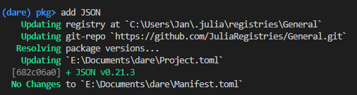

  

  

# Instantiating and managing the "JEG" julia environment

## Setting up the project with VSCode
It's recommended to work in this project with Visual Studio Code.

- In VSCode, use "Open Folder" and select the "JEG" folder that contains the `Project.toml`. This way, VSCode should automatically recognize the julia environment called `JEG` - or it should ask you for selecting an environment and `path/to/JEG` will be in the list to choose.

- Open a new terminal - it should start in the "JEG" folder. Then start julia in it (the command is just `julia` if you included it in your systems PATH variable). Now, type `]` to access the package manager (the prompt color switches from green to blue) and then run `activate .` (with the dot). The project gets activated and it shows the name in the brackets. \
 \
Afterwards, run `instantiate`. A progress starts that automatically installs all the needed packages for the julia environment called `JEG`. \
 \
It gets the information about the required packages from the `Project.toml` and creates a new file called `Manifest.toml` which stores information about all the installed sub-dependencies of these packages. `Manifest.toml` might be different from machine to machine and therefore is a local file that is also excluded from the git via the `.gitignore` file.

- Now, if you "Execute active File in REPL" it should automatically activate the project before running the file. \
 \
It might take some time to precompile packages (which is only done once as long as package versions don't change) and also to precompile parts of your code (which has to be done any time you run in a new REPL).

## Adding, removing or changing packages in development
- To **add** a package to the `JEG` environment while developing, go to an active julia console, access the package manager with `]`, make sure the `JEG` environment is activated (**Important!** Instructions in the paragraph above) and then run `add PackageName`. \
 \
The julia package manager (which is called `Pkg`) then automatically adds the package to the `Project.toml` so the information gets stored in the git.

- To **remove** a package repeat the instructions above but instead of the `add` command use `remove` (or `rm`, which is an alias). \

- If you want to use a **specific version** of a package, use `add PackageName@versionnumber`. \
 \
Previously used versions of the package will get overwritten (in the `.toml` files, not on your disk).
If you want the newest version thats on github, which has no release number yet, you can use `add PackageName#master` (this way you can also add a specific branch).
If you want to add a specific fork of a package or a package that is not officially registered in Pkg, you can also use `add https://github.com/path/to/package.git`.

- If you pulled changes from the git and need to update your `JEG` environment according to the updated `Project.toml`, just access Pkg, make sure the `JEG` environment is activated, and run `instantiate`.
**Do not use `update` for that.** `update` will try to update every package to the newest version and will also overwrite the `Project.toml`. While this is fine in most cases, it might break things if there are changes in the package structures that our code relies on. We will try to run `update` in the development branch itself from time to time in the course of the project.

## How to fix a broken environment
Sometimes you can end up with a messed up environment which should generally be no problem and easy to fix. Here are some things to try:

- Delete your `Manifest.toml` and run `instantiate` again. The `Manifest.toml` will be freshly regenerated.

- Run `precompile` in Pkg mode.

- If you get an error about some libraries that may be "fundamentally broken", open your ".julia" directory (in windows it is usually at `C:\Users\YourName\.julia` and delete the problematic packages from the "packages" and "compiled" folder. After that, run `instantiate` again. The packages will be re-installed.