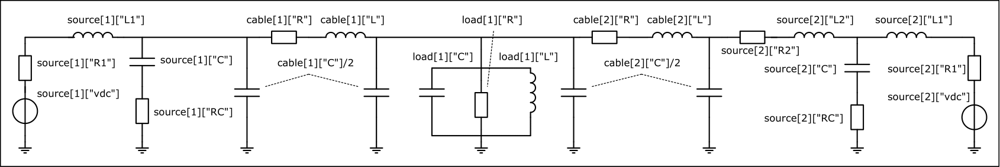

# ElectricGridEnv Demo

This notebook is intended to show the functionality of the ElectricGridEnv which creates an environment for simulation of power-electronic driven microgrids with ad-hoc data generation. It can be used to to train and test reinforcement learing agents (e.g., from [juliareinforcementlearning.jl](https://juliareinforcementlearning.org/)).
These agents can learn to handle different control tasks and can be compared to classical control approaches. In this notebook the following topics are covered:

- ### Create Enviroment 
- ### RL-Env Setup
- ### Detailed Parameterisation

## Create Enviroment 

In the following we will create an environment consisting of an electrical power grid with two sources `num_sources = 2` (which could be for example an inverter fed by a PV plant or a wind turbine or battery) - supplying one load `num_sources = 1`.
An easy exemplary example is shown in the figure below, where a load (household) is supplied by 2 sources (inverters, fed PV plant and wind turbine) via two transmission lines.


For better visuablilty an exemplary shaded electircal circut in the background is displayed as single phase diagram.
(By default a three-phase four wire system is created).
If it is not defined during the initialization of the env, all parameters (connections between the different sources and loads, parameters of the electric components,...) are drawn randomly, while a few are set to fixed value per default.
One of the latter would be for example the stepsize `ts`. 
The most important parameters will be investigated during this notebook.
After the initialization a step-wise interaction with the environment is possible.


To use the JEG tool the JEG package has to be loaded:


```julia
using JEG
```


<div style="padding: 1em; background-color: #f8d6da; border: 1px solid #f5c6cb; font-weight: bold;">
<p>The WebIO Jupyter extension was not detected. See the
<a href="https://juliagizmos.github.io/WebIO.jl/latest/providers/ijulia/" target="_blank">
    WebIO Jupyter integration documentation
</a>
for more information.
</div>


```julia
env = ElectricGridEnv(num_sources = 2, num_loads = 1)
```

    
    ******************************************************************************
    This program contains Ipopt, a library for large-scale nonlinear optimization.
     Ipopt is released as open source code under the Eclipse Public License (EPL).
             For more information visit https://github.com/coin-or/Ipopt
    ******************************************************************************
    


# ElectricGridEnv

## Traits

| Trait Type        |                                            Value |
|:----------------- | ------------------------------------------------:|
| NumAgentStyle     |          ReinforcementLearningBase.SingleAgent() |
| DynamicStyle      |           ReinforcementLearningBase.Simultaneous |
| InformationStyle  | ReinforcementLearningBase.ImperfectInformation() |
| ChanceStyle       |           ReinforcementLearningBase.Stochastic() |
| RewardStyle       |           ReinforcementLearningBase.StepReward() |
| UtilityStyle      |           ReinforcementLearningBase.GeneralSum() |
| ActionStyle       |     ReinforcementLearningBase.MinimalActionSet() |
| StateStyle        |     ReinforcementLearningBase.Observation{Any}() |
| DefaultStateStyle |     ReinforcementLearningBase.Observation{Any}() |

## Is Environment Terminated?

No

## State Space

`ReinforcementLearningBase.Space{Vector{IntervalSets.ClosedInterval{Float64}}}(IntervalSets.ClosedInterval{Float64}[-1.0..1.0, -1.0..1.0, -1.0..1.0, -1.0..1.0, -1.0..1.0, -1.0..1.0, -1.0..1.0, -1.0..1.0, -1.0..1.0, -1.0..1.0, -1.0..1.0, -1.0..1.0, -1.0..1.0, -1.0..1.0, -1.0..1.0, -1.0..1.0, -1.0..1.0, -1.0..1.0, -1.0..1.0, -1.0..1.0, -1.0..1.0, -1.0..1.0, -1.0..1.0, -1.0..1.0, -1.0..1.0, -1.0..1.0, -1.0..1.0])`

## Action Space

`ReinforcementLearningBase.Space{Vector{IntervalSets.ClosedInterval{Float64}}}(IntervalSets.ClosedInterval{Float64}[-1.0..1.0, -1.0..1.0, -1.0..1.0, -1.0..1.0, -1.0..1.0, -1.0..1.0])`

## Current State

```
[0.0, 0.0, 0.0, 0.0, 0.0, 0.0, 0.0, 0.0, 0.0, 0.0, 0.0, 0.0, 0.0, 0.0, 0.0, 0.0, 0.0, 0.0, 0.0, 0.0, 0.0, 0.0, 0.0, 0.0, 0.0, 0.0, 0.0]
```


The initialisation provides some information about the created env since it is conform to the interface like described in [juliareinforcementlearning.jl/env](https://juliareinforcementlearning.org/docs/How_to_write_a_customized_environment/).


Some information is, for example:

 - is the environment terminated (`done`) which can happen in response to a limit violation or by reaching the number of interactions manually defined in the experiment,
 - the range of the inputs (`Action Space`) the environment accepts,
 - the range of the outputs (`State Space`) the environment returns,
 - the `Current State` of the environment.


In the following the most important parts of the `ElectricGridEnv` will be investigated in detail. For this purpose, we will now take a closer look at the generated `env`.

For better readability the first five of the `Current State` of the environment are shown:


```julia
env.state[1:5]
```


    5-element Vector{Float64}:
     0.0
     0.0
     0.0
     0.0
     0.0


Since we have not yet interacted with the env, the `Current State` is still the initial - which by default is zero.
To learn how to interact with the environment applying differnt actions, see `Env_Interaction_DEMO.ipynb`.


If the state is not zero, but shotoe inthe beginninge reset method can  values stored in beenv. used which sets the state to the internally defined `x0` (which consists of zeros per default).
If we do not want to not start from zero, we could set `x0` in the initialisation of the env:


```julia
env.x0 = 0.1 * ones(length(env.state_space))
reset!(env)
env.state[1:5]
```


    5-element Vector{Float64}:
     0.1
     0.1
     0.1
     0.1
     0.1


The `Action Space` defines how many actions can be applied to the env:


```julia
n_a = length(env.action_space)
```


    6


Since per default the env produces a three-phase system we need one action per phase per source. Like shown in the figure above, we have 2 sources (with 3 phases each) leading to 6 actions in total.


Till now we have investigated the difference between states and actions. 
To get a little bit more intuition about what the different states are, the `state_ids` and `action_ids` can be investigated:


```julia
env.state_ids[1:5] # First 5 states
```


    5-element Vector{String}:
     "source1_i_L1_a"
     "source1_v_C_filt_a"
     "source1_v_C_cables_a"
     "source2_i_L1_a"
     "source2_v_C_cables_a"


The labels define to which source the state belongs and what it is. 
For example the first state is called `"source1_i_L1_a"`. That tells, it belongs to the first source (in the picture above the PV plant) and represents the current `i` through the incductor `L1` of phase `a`.
For example, this information can be used to control the current through the filter inductance (or to learn this control task).

Analogously, this can apply to the `action_ids`:


```julia
env.action_ids[1:4] # First 4 actions
```


    4-element Vector{String}:
     "source1_u_a"
     "source2_u_a"
     "source1_u_b"
     "source2_u_b"


For example `"source1_u_a"` belongs to the first source an represents the action `u` applied to phase `a`.

All states of phase `a` of the example in the figure above (PV, windtrubing and houshold) are labeled in the circuit below (curents in red, voltages in green).
Hint: Since the parameters of the elctirc grid (e.g., the filter-types,...) are drawn randmoly, if not pre-defined, the `state-ids` could differ after every execution.
In the subsequent section of this notebook, it is expalined how the parameters of the env can be pre-defined to create reproducable experiments.


If we investigate the `State Space` of the env, we'll see that it ranges from -1.0..1.0:


```julia
env.state_space
```


    ReinforcementLearningBase.Space{Vector{IntervalSets.ClosedInterval{Float64}}}(IntervalSets.ClosedInterval{Float64}[-1.0..1.0, -1.0..1.0, -1.0..1.0, -1.0..1.0, -1.0..1.0, -1.0..1.0, -1.0..1.0, -1.0..1.0, -1.0..1.0, -1.0..1.0  …  -1.0..1.0, -1.0..1.0, -1.0..1.0, -1.0..1.0, -1.0..1.0, -1.0..1.0, -1.0..1.0, -1.0..1.0, -1.0..1.0, -1.0..1.0])


That means, the current `"source1_i_L1_a"` through the filter inductor in the example is normalized by the maximal current allowed to flow through the inductor.
If this parameter is not pre-defined it it set per default based on the filter layout happening in the env.


All (technical) parameters needed for the simulation are defined in the parameter dict (for detailed information see below and Default_Parameters.ipynb).
It can be investigated by:


```julia
env.nc.parameters
```


    Dict{Any, Any} with 4 entries:
      "source" => Any[Dict{Any, Any}("L1"=>0.00136613, "C"=>3.85308e-5, "mode"=>"Sy…
      "grid"   => Dict{Any, Any}("f_grid"=>50, "Δfmax"=>0.5, "fs"=>10000.0, "proces…
      "load"   => Any[Dict{Any, Any}("Z"=>9.82531-3.72433im, "C"=>0.000230941, "i_l…
      "cable"  => Any[Dict{Any, Any}("Cb"=>4.0e-7, "Lb"=>0.000264, "Rb"=>0.722, "C"…


The limit of the filter inductor current can be found using:


```julia
env.nc.parameters["source"][1]["i_limit"]
```


    173.9450319852491


Which returns the current limit (belonging to the inductor) of source one.
The voltage limit for normalization is depending on the filter capacitor and can be found using `env.nc.parameters["source"][1]["v_limit"]`.
The same concept holds for the cables and loads (parametrization can be found in the parameter dict, too).

Since the `Action Space` is defined in a range -1.0..1.0, the actions are "normalized" by the DC-link voltage of the specific source. 
In the simulation the chosen action is multiplied by half of the DC-link voltage (and can be interpreted as modulation index in an electrical engineering context).
The DC-link voltage can be found in (or set via) the parameter dict, too:


```julia
env.nc.parameters["source"][1]["vdc"]
```


    800


The following figure shows the physical parameters of our example grid, which are also included in the parameter dict.



## Setting Parameters

The wanted setting of the simulation can be adjusted using the parameter dict. As shown above, there are 4 keys: `"grid"`, `"source"`, `"cable"` and `"load"`. The most important parameters will be explained in the following:


### Grid
Defines the basic setting of the whole electrical power grid. The moste important parameters are:

- `"f_grid"`: grid frequency (frequency of the sine wave) (default: 50 Hz)
- `"phases"`: number of phases in the electric power grid (exclusive neutral). (default: 3)
- `"fs"`: sample frequency of the simulation. Every step the environment if simulated `ts = 1/fs` s forward (default: 10 kHz)
- `"v_rms"`: root mean square value of the basic grid voltage (default: 230 V)
- ...


```julia
env.nc.parameters["grid"]
```


    Dict{Any, Any} with 9 entries:
      "f_grid"        => 50
      "Δfmax"         => 0.5
      "fs"            => 10000.0
      "process_start" => 0.04
      "phase"         => 3
      "ramp_end"      => 0.04
      "ΔEmax"         => 5
      "pwr"           => 100000.0
      "v_rms"         => 230


### Source
Here, a list with all sources of the network can be found. Each source is in turn stored as a dict.


```julia
env.nc.parameters["source"]
```


    2-element Vector{Any}:
     Dict{Any, Any}("L1" => 0.0013661303012524096, "C" => 3.8530760217108454e-5, "mode" => "Synchronverter", "fltr" => "LC", "pwr" => 50000.0, "source_type" => "ideal", "R_C" => 1.984819502142645, "std_asy" => 12500.0, "σ" => 0.0, "i_limit" => 173.9450319852491…)
     Dict{Any, Any}("L1" => 0.0013661303012524096, "mode" => "Synchronverter", "fltr" => "L", "pwr" => 50000.0, "source_type" => "ideal", "std_asy" => 12500.0, "σ" => 0.0, "i_limit" => 173.9450319852491, "v_rip" => 0.01537, "v_δ_set" => 0.0…)


A selection of the most important parameters that can be defined and configured via the parameter dict is given in the following:

- `"pwr"`: maximum aparent power of the source (default: random)
- `"source_type"`: type of the electric component sitting on the DC side, e.g. ideal (constant `vdc`), PV,... (default: ideal)
- `"control_type"`: defines whether the source is classically controlled or RL controlled (default = "classic")
- `"mode"`: allows to specify which control mode the source (default = "Droop", and classic control_type) (for more information, see Classic_Controllers_Notebook.iypnb)
- `"vdc"`: DC-link voltage, fixed if `"source_type"` is ideal (drawn random $U$[690, 800] V), otherwise drawn from function
- `"fltr"`: Filter type [L, LC, LCL], default: random
- `"i_limit"`: maximal allowed current flowing through the inductor(s) (default: calculated based on filter parameters)
- `"v_limit"`: maximal allowed voltage across the capacitor (default: calculated based on filter parameters).
- ...

The parameters of the first source are for example:


```julia
env.nc.parameters["source"][1]
```


    Dict{Any, Any} with 28 entries:
      "L1"           => 0.00136613
      "C"            => 3.85308e-5
      "mode"         => "Synchronverter"
      "fltr"         => "LC"
      "pwr"          => 50000.0
      "source_type"  => "ideal"
      "R_C"          => 1.98482
      "std_asy"      => 12500.0
      "σ"            => 0.0
      "i_limit"      => 173.945
      "v_rip"        => 0.01537
      "v_δ_set"      => 0.0
      "vdc"          => 800
      "τv"           => 0.002
      "k"            => 0
      "control_type" => "classic"
      "v_pu_set"     => 1.0
      "τf"           => 0.002
      "i_rip"        => 0.15
      "κ"            => 0.0
      "R1"           => 0.273226
      "v_limit"      => 1209.22
      "Δt"           => 0.02
      "γ"            => 0
      "X₀"           => 0
      ⋮              => ⋮


### Load
Here, a list with all loads of the network can be found. Each load is in turn stored as a dict.


```julia
env.nc.parameters["load"]
```


    1-element Vector{Any}:
     Dict{Any, Any}("Z" => 9.82531281288877 - 3.724326693596644im, "C" => 0.00023094137729980403, "i_limit" => 27.860332095385235, "L" => 0.08199681734779203, "R" => 11.23703471780778, "pwr" => 15103.509475579685, "pf" => -0.935076907183365, "impedance" => "RLC")


Defines passive loads which can be pluged/connected to the grid. All combinations of the passive components of a resistor, inductor and capacitor ("impedance") can be chosen:

- `"impedance"`: type/circuit of the load (can be something out of [RLC, RL, RC, LC, R, L, C]). Components will be connected in parallel (default: random)
- `"pwr"`: apparant power of drawn from the load assuming fixed vrms grid voltage and frequency and the number of phases (see parameters of "grid")
- `"pf"`: power factor resulting from chosen parameters
- `"Z"`: impedance resulting from chosen parameters
- `"R"`: load resistance
- ...


The parameters of the load, since only one is definde, are for example:


```julia
env.nc.parameters["load"][1]
```


    Dict{Any, Any} with 8 entries:
      "Z"         => 9.82531-3.72433im
      "C"         => 0.000230941
      "i_limit"   => 27.8603
      "L"         => 0.0819968
      "R"         => 11.237
      "pwr"       => 15103.5
      "pf"        => -0.935077
      "impedance" => "RLC"


### Cable
Here, a list with all cables of the network can be found. Each cable is in turn stored as a dict.


```julia
env.nc.parameters["cable"]
```


    2-element Vector{Any}:
     Dict{Any, Any}("Cb" => 4.0e-7, "Lb" => 0.000264, "Rb" => 0.722, "C" => 0.0004, "len" => 1.0, "L" => 0.00025, "R" => 0.208)
     Dict{Any, Any}("Cb" => 4.0e-7, "Lb" => 0.000264, "Rb" => 0.722, "C" => 0.0004, "len" => 1.0, "L" => 0.00025, "R" => 0.208)


The cables are modelled using PI-models like shown in the figure above.
If no parameters are defined they are chosen based on the power flowing through the cable.


- `"len"`: length of the cable (default: random [1m, 1km])
- `"i_limit"`: mamimal allowed current flowing through the inductor (default: calculated based on power flow and inductance)
- `"v_limit"`: since the capacitance it added to the one (if) defined in the source, the limit for the voltage can be found in the source parameter dict
- `"Cb"`: cable capacity coatings (default: 0.4 µF/km)
- `"Lb"`: cable operating inductor (default: 0.264 mH/km)
- `"Rb"`: cable AC resistor (default: 0.722 Ohm/km)
- `"C"`: cable capacity (default: `"len"`*`"Cb"`)
- `"L"`: cable inductance (default: `"len"`*`"Lb"`)
- `"R"`: cable resistance (default: `"len"`*`"Rb"`)

The parameters of the first cable are for example:


```julia
env.nc.parameters["cable"][1]
```


    Dict{Any, Any} with 7 entries:
      "Cb"  => 4.0e-7
      "Lb"  => 0.000264
      "Rb"  => 0.722
      "C"   => 0.0004
      "len" => 1.0
      "L"   => 0.00025
      "R"   => 0.208


For all information about the parameters which can be defined investigate the parameter dict itself or have a look into the documentation (`LINK`).

The next step would be to interact with the env to run an experiment.
To learn how to do this, see the `Env_Interaction_DEMO.ipynb`.
