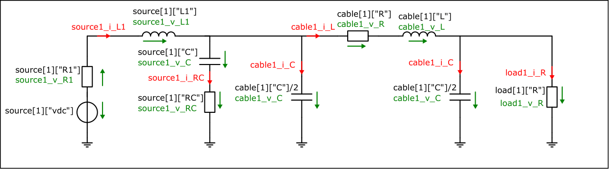
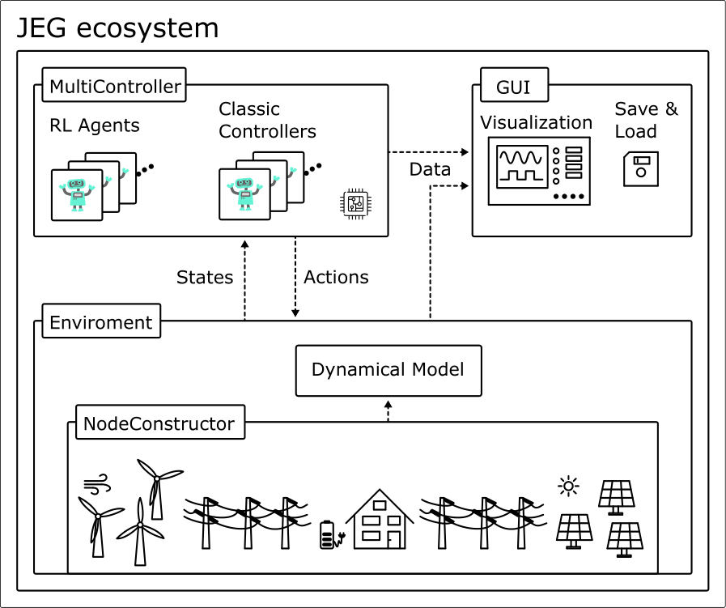

# Interaction with the ElectricGridEnv

In the previous [section](https://upb-lea.github.io/ElectricGrid.jl/dev/Env_Create/) it was shown how to set up an environment.
This section is intended to show how to interact with the environment and, above all, how to extract, store the data and covers the following topics:

- ### Apply actions,
- ### Data hook (how to tap the simulated data stream),
- ### AC grid example.

The interactive content related to the section described here can be found in the form of a notebook [here](https://github.com/upb-lea/ElectricGrid.jl/blob/main/examples/notebooks/Env_Interaction_DEMO.ipynb).

## Basic interaction with the environment

The dynamic behaviour of the environment is simulated using linear state-space models. 
It interacts step-wise with the agent/controller like shown in the figure below. 
Based on the input/action `u` at timestep `k` the state `x` is calculated.


Based on that action `u_k` and the internal state-space model, the system response is evolved for one timestep and the new states `x_k+1` are calulated.
The state-space model is defined depending on the electric components - for more information about the ordinary differential equations behind,... see [The Nodecontructor - Theory](https://upb-lea.github.io/ElectricGrid.jl/dev/NodeConstructor_Theory/).

In the following will be described how to use the described parameter dict to define a simple, small example `env` to learn how to interact with it.
This environment consists of a single phase electrical power grid with 1 source and 1 load as shown in the figure below. For reasons of clarity, only phase a is shown:



To get an `env` consisting of that specific setting with the correct filter type and load, the parameter dict is defined in beforehand and handed over to the `env`.
Instead of `num_sorces` and `num_loads`, now the parameter dict and the connection matrix `CM` is used which defines if there is a connection between two nodes (e.g., source <-> load) or not. 
If there is a connetion the corresponding matrix entry is not zero, if there is no connection the entry is `0`. For more information about the CM matrix see [The Nodecontructor - Application](https://upb-lea.github.io/ElectricGrid.jl/dev/NodeConstructor_Application/).

To create a usefull example we first calulate a load which fits in case of power rating to the power of the source.
Therefore, the function `ParallelLoadImpedance()` provied by the `ElectricGrid` package is used which calulates the passive parameters for a load for specified apparant power.


```julia
using ElectricGrid

S_source = 200e3

S_load = 150e3
pf_load = 1
v_rms = 230
R_load, L_load, X, Z = ParallelLoadImpedance(S_load, pf_load, v_rms)
```

Then we use these values during definition of the `env` in the parameter dict.


```julia
CM = [0. 1.
    -1. 0.]

parameters = Dict{Any, Any}(
        "source" => Any[
                        Dict{Any, Any}("pwr" => S_source, "control_type" => "classic", "mode" => "Step", "fltr" => "LC"),
                        ],
        "load"   => Any[
                        Dict{Any, Any}("impedance" => "R", "R" => R_load),
                        ],
        "cable"   => Any[
                        Dict{Any, Any}("R" => 1e-3, "L" => 1e-4, "C" => 1e-4, "i_limit" => 1e4, "v_limit" => 1e4,),
                        ],
        "grid" => Dict{Any, Any}("fs"=>1e4, "phase"=>3, "v_rms"=>230, "f_grid" => 50, "ramp_end"=>0.0)
    )


env = ElectricGridEnv(CM = CM, parameters = parameters)

env.state_ids[1:5]
```


    5-element Vector{String}:
     "source1_i_L1_a"
     "source1_v_C_filt_a"
     "source1_v_C_cables_a"
     "cable1_i_L_a"
     "load1_v_C_total_a"


As can be seen, the five states marked in the equivalent circuit diagram in the figure above can be found via the `env.state_ids` (`_a` marking the phase is not displayed in the figure).
Analog, the `action_ids` can be found which consists of 3 entries, one per phase for the defined source.


```julia
env.action_ids
```


    3-element Vector{String}:
     "source1_u_a"
     "source1_u_b"
     "source1_u_c"


To interact with the env, the function `env(action)` can be called:


```julia
env([0.2, 0.2, 0.2])
```


Here, the source gets an action of `0.2` to all three phases.
This interaction can be done in a loop while the state is logged during this process:


```julia
# run 3 steps
reset!(env)
for _ in 1:3
    env([0.2, 0.2, 0.2])
end

env.state[1:5]  # print states after 3 steps
```


    5-element Vector{Float64}:
     0.06548135420290145
     0.013847803005637331
     0.01692657505439206
     0.0012287741401077802
     0.020386045162012048


The `control_type` of the source is chosen as classic in `mode => Step`. That means it is open loop and a step is given to the input resulting in an input voltage of `env.nc.parameters["grid"]["v_rms"]`. For more information about possible control modes, see `ClassicalController_Notebook` or [documentation](https://upb-lea.github.io/ElectricGrid.jl/dev/classical/).

## The MultiController

The `ElectricGrid` toolbox provides a more enhanced method to run an experiment with a specific number of steps and even more episodes.
It is based in the `run` command provided by the [ReinforcementLeaning.jl/run](https://github.com/JuliaReinforcementLearning/ReinforcementLearning.jl/blob/master/src/ReinforcementLearningCore/src/core/run.jl) toolbox and, therefore, can be used to `learn` a control task or to `simulate` a fixed setup.

First we take a look onto simulating the behaviour of an env without learning. Therefore, the `Simulate()` function from the `MultiController` is used. 
This acts as a configuration tool to define the corresponding classic controllers and RL agents.
Additionally, it links inputs to the `env.state_ids` and outputs to the `env.action_ids`.

In our example, we only apply classic controllers to learn how the tool works (learning with RL agents is investigated in `RL_Single_Agent_DEMO.ipynb`). 
The interaction of the different components (env, agent, classic controllers, wrapper,...) is shown in the diagram below.





The depicted multiagent ensures that the states and actions for every source are exchanged with the correct agent or classic controller. This is depending on the `control_types` and `mode`s.
Therefore, the `SetupAgents(env)` method returns a `Controller` of type `MultiController`.


Then, the experiment is executed for (default) one episode. The length of the episode is defined depending on the parameter `env.maxsteps` (default = 500), which alternatively can be defined via `env.t_end` and `env.ts`. 
Inside `Simulate()` the run command (RL.base) executes 500 steps applying the defined controllers in the env.
Every step the control inputs are calculated based on the corresponding states and the env is evolved for `ts`. Then, the new state is given to the controller/agent again. 

The 500 steps only gets executed if none of the defined voltage and current limits of the states are exceeded (which would be equivalent to a system crash).
In that case, a flag in the env is set (`env.done = true`) which terminates the episode.

To investigate the env <-> agent interaction (without learning), the `Simulate()` method can be used.


```julia
Controller = SetupAgents(env);
hook = Simulate(Controller, env);
hook.df
```

If not defined in beforehand and handed over to the `Simulate()` methode, it returns a default `hook`. 


## Data-Hook (how to tap the simulated data stream)

To collect the data - so how the states evolved over time by the chosen actions - hooks ([ReinforcmentLearning.jl/data-hooks](https://juliareinforcementlearning.org/docs/How_to_use_hooks/)) are used which will be executed at different stages of the experiment.
Via theses hooks the data to be collected is stored in a `DataFrame` labeled via the state and action IDs. This all happens using the `DataHook` provided by the `ElectricGrid` package.

This `DataFrame` can be seen in the output of the upper cell. It contains 500 rows - one for each simulated step.
In the different colons the information about the simulation is stored, e.g., the number of the episode, time, states, actions...
By default a `DefaultDataHook` is generated which collects all available information about the states of the `env`. 

If we are interested how the state of the current through the filter inductor of source 1 (first state in the env `source1_i_L1_a`) evolves over time, we can grap the data like follows:


```julia
id = env.state_ids[1] # get first state_id
println(id)
hook.df[:, id]
```

    source1_i_L1_a


    500-element Vector{Float64}:
       0.0
       0.0
      64.38793241613949
     118.5118638524073
     159.6623242035541
     188.4161060129909
     206.7479466095761
     216.9637166049256
     221.29328943565338
     221.71322649159114
       ⋮
     204.02614278089519
     204.02614278089519
     204.02614278089519
     204.02614278089519
     204.02614278089519
     204.02614278089519
     204.02614278089519
     204.02614278089519
     204.02614278089519


If we only want to log specific states during the experiment, a `DataHook` can be defined in beforehand.
It only has to be defined which states and actions should be logged during initialisation. Then the `hook` has to be handed over to the `Simulate()` (or `Learn()`) command.

In the following, we will collect only the state `"source1_i_L1_a"` and the first action `"source1_u_a"`.
Alternatively, for example the number of source can be used to collect all the data for a specific source (compare out-commented example code). A lot of other flags can be defined to collect more measurements (RMS, reward, powers,...).
For more details we refer to the documentation and the other example notebooks.


```julia
hook = DataHook(collect_state_ids = ["source1_i_L1_a"],
                collect_action_ids = ["source1_u_a"]
                #collect_sources  = [1]  # alternative collect all data of source 1 
                );

Simulate(Controller, env, hook=hook);

hook.df
```


```@raw html
<div class="data-frame"><p>500 rows × 10 columns (omitted printing of 4 columns)</p><table class="data-frame"><thead><tr><th></th><th>episode</th><th>time</th><th>source1_i_L1_a</th><th>source1_v_L1_a</th><th>action</th><th>next_state_source1_i_L1_a</th></tr><tr><th></th><th title="Int64">Int64</th><th title="Float32">Float32</th><th title="Float64">Float64</th><th title="Float64">Float64</th><th title="Vector{Union{Nothing, Float64}}">Array…</th><th title="Float64">Float64</th></tr></thead><tbody><tr><th>1</th><td>1</td><td>0.0</td><td>0.0</td><td>0.0</td><td>[0.575, 0.575, 0.575]</td><td>0.0</td></tr><tr><th>2</th><td>1</td><td>0.0001</td><td>0.0</td><td>0.0</td><td>[0.575, 0.575, 0.575]</td><td>64.3879</td></tr><tr><th>3</th><td>1</td><td>0.0002</td><td>64.3879</td><td>205.206</td><td>[0.575, 0.575, 0.575]</td><td>118.512</td></tr><tr><th>4</th><td>1</td><td>0.0003</td><td>118.512</td><td>163.059</td><td>[0.575, 0.575, 0.575]</td><td>159.662</td></tr><tr><th>5</th><td>1</td><td>0.0004</td><td>159.662</td><td>118.471</td><td>[0.575, 0.575, 0.575]</td><td>188.416</td></tr><tr><th>6</th><td>1</td><td>0.0005</td><td>188.416</td><td>79.1171</td><td>[0.575, 0.575, 0.575]</td><td>206.748</td></tr><tr><th>7</th><td>1</td><td>0.0006</td><td>206.748</td><td>47.433</td><td>[0.575, 0.575, 0.575]</td><td>216.964</td></tr><tr><th>8</th><td>1</td><td>0.0007</td><td>216.964</td><td>23.6258</td><td>[0.575, 0.575, 0.575]</td><td>221.293</td></tr><tr><th>9</th><td>1</td><td>0.0008</td><td>221.293</td><td>7.07961</td><td>[0.575, 0.575, 0.575]</td><td>221.713</td></tr><tr><th>10</th><td>1</td><td>0.0009</td><td>221.713</td><td>-3.29035</td><td>[0.575, 0.575, 0.575]</td><td>219.837</td></tr><tr><th>11</th><td>1</td><td>0.001</td><td>219.837</td><td>-8.84257</td><td>[0.575, 0.575, 0.575]</td><td>216.869</td></tr><tr><th>12</th><td>1</td><td>0.0011</td><td>216.869</td><td>-10.9624</td><td>[0.575, 0.575, 0.575]</td><td>213.633</td></tr><tr><th>13</th><td>1</td><td>0.0012</td><td>213.633</td><td>-10.866</td><td>[0.575, 0.575, 0.575]</td><td>210.628</td></tr><tr><th>14</th><td>1</td><td>0.0013</td><td>210.628</td><td>-9.51317</td><td>[0.575, 0.575, 0.575]</td><td>208.116</td></tr><tr><th>15</th><td>1</td><td>0.0014</td><td>208.116</td><td>-7.60108</td><td>[0.575, 0.575, 0.575]</td><td>206.185</td></tr><tr><th>16</th><td>1</td><td>0.0015</td><td>206.185</td><td>-5.59584</td><td>[0.575, 0.575, 0.575]</td><td>204.82</td></tr><tr><th>17</th><td>1</td><td>0.0016</td><td>204.82</td><td>-3.77656</td><td>[0.575, 0.575, 0.575]</td><td>203.942</td></tr><tr><th>18</th><td>1</td><td>0.0017</td><td>203.942</td><td>-2.28148</td><td>[0.575, 0.575, 0.575]</td><td>203.448</td></tr><tr><th>19</th><td>1</td><td>0.0018</td><td>203.448</td><td>-1.15116</td><td>[0.575, 0.575, 0.575]</td><td>203.234</td></tr><tr><th>20</th><td>1</td><td>0.0019</td><td>203.234</td><td>-0.365185</td><td>[0.575, 0.575, 0.575]</td><td>203.206</td></tr><tr><th>21</th><td>1</td><td>0.002</td><td>203.206</td><td>0.129335</td><td>[0.575, 0.575, 0.575]</td><td>203.288</td></tr><tr><th>22</th><td>1</td><td>0.0021</td><td>203.288</td><td>0.397567</td><td>[0.575, 0.575, 0.575]</td><td>203.423</td></tr><tr><th>23</th><td>1</td><td>0.0022</td><td>203.423</td><td>0.503928</td><td>[0.575, 0.575, 0.575]</td><td>203.573</td></tr><tr><th>24</th><td>1</td><td>0.0023</td><td>203.573</td><td>0.504717</td><td>[0.575, 0.575, 0.575]</td><td>203.713</td></tr><tr><th>&vellip;</th><td>&vellip;</td><td>&vellip;</td><td>&vellip;</td><td>&vellip;</td><td>&vellip;</td><td>&vellip;</td></tr></tbody></table></div>
```


Investigating the `DataFrame` we can see, that even more states then planned are logged.
The `ElectricGrid` framework stores all information available with regards to the state we have chosen.
Here, additionally the voltage across the inductor and the state after the action is applied is stored as well. 
For more detailed information, see `API-Doku -> DataHook`.

After the experiment, the `RenderHookResults()` function provided by the `ElectricGrid` package can be used to show the results of the simulated episode.
States and actions which are logged with the `DataHook` can be selected to be plotted:


```julia
RenderHookResults(hook = hook, 
                    episode = 1,
                    states_to_plot  = ["source1_i_L1_a"],  
                    actions_to_plot = ["source1_u_a"])
```


```@raw html
<html>
<head><meta charset="utf-8" /></head>
<body>
<div>
    <script src="https://cdnjs.cloudflare.com/ajax/libs/mathjax/2.7.5/MathJax.js?config=TeX-AMS-MML_SVG"></script>
    <script type="text/javascript">
window.PlotlyConfig = {MathJaxConfig: 'local'};
</script>
<script src="https://cdn.plot.ly/plotly-2.3.0.min.js"></script>

    <div
        id=e880d042-b78f-4fd2-b830-1d391da05442
        class="plotly-graph-div"
        style="height:550; width:800;">
    </div>
    <script type="text/javascript">
        require(["plotly"], function(Plotly) {
        window.PLOTLYENV = window.PLOTLYENV || {}

        if (document.getElementById('e880d042-b78f-4fd2-b830-1d391da05442')) {
    Plotly.newPlot(
        'e880d042-b78f-4fd2-b830-1d391da05442',
        [{"mode":"lines","y":[0.0,0.0,64.38793241613949,118.5118638524073,159.6623242035541,188.4161060129909,206.7479466095761,216.9637166049256,221.29328943565338,221.71322649159114,219.8367451927113,216.86946134952478,213.63266189864294,210.62814748862388,208.11562035578092,206.1854704562471,204.8201144224328,203.94197705986846,203.4482943016633,203.2341525188756,203.20596050024997,203.2878095008349,203.42300340218569,203.57264195365153,203.71268291977412,203.8304812774211,203.92144147568436,203.9861347905061,204.0280281740861,204.05183535822886,204.06242195603028,204.0641592071727,204.06061232781443,204.05445805971138,204.04754355688593,204.04101931368209,204.0354986801848,204.03121356542715,204.02814934516388,204.02615171693077,204.02500469181385,204.02448270747166,204.02438166738204,204.0245341813289,204.02481392135104,204.02513321308538,204.02543703440074,204.0256956702847,204.02589747471717,204.02604255896978,204.02613776569044,204.02619298125333,204.02621865653984,204.02622431724677,204.02621781988293,204.02620512445546,204.02619039072627,204.0261762485838,204.0261641359845,204.02615463526732,204.02614776834156,204.02614323300256,204.02614057723233,204.0261393170932,204.02613900817366,204.02613928184965,204.0261398570288,204.0261405364264,204.0261411944127,204.02614176147813,204.02614220861417,204.02614253351294,204.02614274945944,204.02614287709605,204.02614293881862,204.02614295535238,204.02614294398714,204.02614291797573,204.02614288667112,204.02614285607132,204.02614282953294,204.02614280849608,204.02614279312945,204.0261427828521,204.02614277672254,204.02614277370492,204.0261427728332,204.02614277329664,204.0261427744706,204.0261427759119,204.0261427773343,204.0261427785758,204.02614277956525,204.0261427802918,204.0261427807807,204.02614278107484,204.0261427812221,204.02614278126754,204.02614278124906,204.0261427811962,204.0261427811299,204.0261427810638,204.02614278100575,204.02614278095922,204.0261427809249,204.02614278090164,204.02614278088757,204.02614278088038,204.02614278087805,204.02614278087876,204.02614278088117,204.02614278088421,204.02614278088726,204.02614278088998,204.02614278089214,204.02614278089376,204.02614278089487,204.02614278089558,204.02614278089592,204.0261427808961,204.02614278089607,204.02614278089595,204.0261427808958,204.02614278089564,204.02614278089547,204.02614278089536,204.0261427808953,204.02614278089524,204.02614278089519,204.02614278089519,204.02614278089519,204.02614278089519,204.02614278089519,204.02614278089519,204.02614278089519,204.0261427808952,204.0261427808952,204.0261427808952,204.02614278089519,204.02614278089519,204.02614278089519,204.02614278089519,204.02614278089519,204.02614278089519,204.02614278089519,204.02614278089519,204.02614278089519,204.02614278089519,204.02614278089519,204.02614278089519,204.02614278089519,204.02614278089519,204.02614278089519,204.02614278089519,204.02614278089519,204.02614278089519,204.02614278089519,204.02614278089519,204.02614278089519,204.02614278089519,204.02614278089519,204.02614278089519,204.02614278089519,204.02614278089519,204.02614278089519,204.02614278089519,204.02614278089519,204.02614278089519,204.02614278089519,204.02614278089519,204.02614278089519,204.02614278089519,204.02614278089519,204.02614278089519,204.02614278089519,204.02614278089519,204.02614278089519,204.02614278089519,204.02614278089519,204.02614278089519,204.02614278089519,204.02614278089519,204.02614278089519,204.02614278089519,204.02614278089519,204.02614278089519,204.02614278089519,204.02614278089519,204.02614278089519,204.02614278089519,204.02614278089519,204.02614278089519,204.02614278089519,204.02614278089519,204.02614278089519,204.02614278089519,204.02614278089519,204.02614278089519,204.02614278089519,204.02614278089519,204.02614278089519,204.02614278089519,204.02614278089519,204.02614278089519,204.02614278089519,204.02614278089519,204.02614278089519,204.02614278089519,204.02614278089519,204.02614278089519,204.02614278089519,204.02614278089519,204.02614278089519,204.02614278089519,204.02614278089519,204.02614278089519,204.02614278089519,204.02614278089519,204.02614278089519,204.02614278089519,204.02614278089519,204.02614278089519,204.02614278089519,204.02614278089519,204.02614278089519,204.02614278089519,204.02614278089519,204.02614278089519,204.02614278089519,204.02614278089519,204.02614278089519,204.02614278089519,204.02614278089519,204.02614278089519,204.02614278089519,204.02614278089519,204.02614278089519,204.02614278089519,204.02614278089519,204.02614278089519,204.02614278089519,204.02614278089519,204.02614278089519,204.02614278089519,204.02614278089519,204.02614278089519,204.02614278089519,204.02614278089519,204.02614278089519,204.02614278089519,204.02614278089519,204.02614278089519,204.02614278089519,204.02614278089519,204.02614278089519,204.02614278089519,204.02614278089519,204.02614278089519,204.02614278089519,204.02614278089519,204.02614278089519,204.02614278089519,204.02614278089519,204.02614278089519,204.02614278089519,204.02614278089519,204.02614278089519,204.02614278089519,204.02614278089519,204.02614278089519,204.02614278089519,204.02614278089519,204.02614278089519,204.02614278089519,204.02614278089519,204.02614278089519,204.02614278089519,204.02614278089519,204.02614278089519,204.02614278089519,204.02614278089519,204.02614278089519,204.02614278089519,204.02614278089519,204.02614278089519,204.02614278089519,204.02614278089519,204.02614278089519,204.02614278089519,204.02614278089519,204.02614278089519,204.02614278089519,204.02614278089519,204.02614278089519,204.02614278089519,204.02614278089519,204.02614278089519,204.02614278089519,204.02614278089519,204.02614278089519,204.02614278089519,204.02614278089519,204.02614278089519,204.02614278089519,204.02614278089519,204.02614278089519,204.02614278089519,204.02614278089519,204.02614278089519,204.02614278089519,204.02614278089519,204.02614278089519,204.02614278089519,204.02614278089519,204.02614278089519,204.02614278089519,204.02614278089519,204.02614278089519,204.02614278089519,204.02614278089519,204.02614278089519,204.02614278089519,204.02614278089519,204.02614278089519,204.02614278089519,204.02614278089519,204.02614278089519,204.02614278089519,204.02614278089519,204.02614278089519,204.02614278089519,204.02614278089519,204.02614278089519,204.02614278089519,204.02614278089519,204.02614278089519,204.02614278089519,204.02614278089519,204.02614278089519,204.02614278089519,204.02614278089519,204.02614278089519,204.02614278089519,204.02614278089519,204.02614278089519,204.02614278089519,204.02614278089519,204.02614278089519,204.02614278089519,204.02614278089519,204.02614278089519,204.02614278089519,204.02614278089519,204.02614278089519,204.02614278089519,204.02614278089519,204.02614278089519,204.02614278089519,204.02614278089519,204.02614278089519,204.02614278089519,204.02614278089519,204.02614278089519,204.02614278089519,204.02614278089519,204.02614278089519,204.02614278089519,204.02614278089519,204.02614278089519,204.02614278089519,204.02614278089519,204.02614278089519,204.02614278089519,204.02614278089519,204.02614278089519,204.02614278089519,204.02614278089519,204.02614278089519,204.02614278089519,204.02614278089519,204.02614278089519,204.02614278089519,204.02614278089519,204.02614278089519,204.02614278089519,204.02614278089519,204.02614278089519,204.02614278089519,204.02614278089519,204.02614278089519,204.02614278089519,204.02614278089519,204.02614278089519,204.02614278089519,204.02614278089519,204.02614278089519,204.02614278089519,204.02614278089519,204.02614278089519,204.02614278089519,204.02614278089519,204.02614278089519,204.02614278089519,204.02614278089519,204.02614278089519,204.02614278089519,204.02614278089519,204.02614278089519,204.02614278089519,204.02614278089519,204.02614278089519,204.02614278089519,204.02614278089519,204.02614278089519,204.02614278089519,204.02614278089519,204.02614278089519,204.02614278089519,204.02614278089519,204.02614278089519,204.02614278089519,204.02614278089519,204.02614278089519,204.02614278089519,204.02614278089519,204.02614278089519,204.02614278089519,204.02614278089519,204.02614278089519,204.02614278089519,204.02614278089519,204.02614278089519,204.02614278089519,204.02614278089519,204.02614278089519,204.02614278089519,204.02614278089519,204.02614278089519,204.02614278089519,204.02614278089519,204.02614278089519,204.02614278089519,204.02614278089519,204.02614278089519,204.02614278089519,204.02614278089519,204.02614278089519,204.02614278089519,204.02614278089519,204.02614278089519,204.02614278089519,204.02614278089519,204.02614278089519,204.02614278089519,204.02614278089519,204.02614278089519,204.02614278089519,204.02614278089519,204.02614278089519,204.02614278089519,204.02614278089519,204.02614278089519,204.02614278089519,204.02614278089519,204.02614278089519,204.02614278089519,204.02614278089519,204.02614278089519,204.02614278089519,204.02614278089519,204.02614278089519,204.02614278089519,204.02614278089519,204.02614278089519,204.02614278089519,204.02614278089519,204.02614278089519,204.02614278089519,204.02614278089519,204.02614278089519,204.02614278089519,204.02614278089519,204.02614278089519,204.02614278089519,204.02614278089519,204.02614278089519,204.02614278089519,204.02614278089519,204.02614278089519,204.02614278089519,204.02614278089519,204.02614278089519,204.02614278089519,204.02614278089519,204.02614278089519,204.02614278089519,204.02614278089519,204.02614278089519,204.02614278089519,204.02614278089519],"type":"scatter","name":"source1_i_L1_a","x":[0.0,0.0001,0.0002,0.0003,0.0004,0.0005,0.0006,0.0007,0.0008,0.0009,0.001,0.0011,0.0012,0.0013,0.0014,0.0015,0.0016,0.0017,0.0018,0.0019,0.002,0.0021,0.0022,0.0023,0.0024,0.0025,0.0026,0.0027,0.0028,0.0029,0.003,0.0031,0.0032,0.0033,0.0034,0.0035,0.0036,0.0037,0.0038,0.0039,0.004,0.0041,0.0042,0.0043,0.0044,0.0045,0.0046,0.0047,0.0048,0.0049,0.005,0.0051,0.0052,0.0053,0.0054,0.0055,0.0056,0.0057,0.0058,0.0059,0.006,0.0061,0.0062,0.0063,0.0064,0.0065,0.0066,0.0067,0.0068,0.0069,0.007,0.0071,0.0072,0.0073,0.0074,0.0075,0.0076,0.0077,0.0078,0.0079,0.008,0.0081,0.0082,0.0083,0.0084,0.0085,0.0086,0.0087,0.0088,0.0089,0.009,0.0091,0.0092,0.0093,0.0094,0.0095,0.0096,0.0097,0.0098,0.0099,0.01,0.0101,0.0102,0.0103,0.0104,0.0105,0.0106,0.0107,0.0108,0.0109,0.011,0.0111,0.0112,0.0113,0.0114,0.0115,0.0116,0.0117,0.0118,0.0119,0.012,0.0121,0.0122,0.0123,0.0124,0.0125,0.0126,0.0127,0.0128,0.0129,0.013,0.0131,0.0132,0.0133,0.0134,0.0135,0.0136,0.0137,0.0138,0.0139,0.014,0.0141,0.0142,0.0143,0.0144,0.0145,0.0146,0.0147,0.0148,0.0149,0.015,0.0151,0.0152,0.0153,0.0154,0.0155,0.0156,0.0157,0.0158,0.0159,0.016,0.0161,0.0162,0.0163,0.0164,0.0165,0.0166,0.0167,0.0168,0.0169,0.017,0.0171,0.0172,0.0173,0.0174,0.0175,0.0176,0.0177,0.0178,0.0179,0.018,0.0181,0.0182,0.0183,0.0184,0.0185,0.0186,0.0187,0.0188,0.0189,0.019,0.0191,0.0192,0.0193,0.0194,0.0195,0.0196,0.0197,0.0198,0.0199,0.02,0.0201,0.0202,0.0203,0.0204,0.0205,0.0206,0.0207,0.0208,0.0209,0.021,0.0211,0.0212,0.0213,0.0214,0.0215,0.0216,0.0217,0.0218,0.0219,0.022,0.0221,0.0222,0.0223,0.0224,0.0225,0.0226,0.0227,0.0228,0.0229,0.023,0.0231,0.0232,0.0233,0.0234,0.0235,0.0236,0.0237,0.0238,0.0239,0.024,0.0241,0.0242,0.0243,0.0244,0.0245,0.0246,0.0247,0.0248,0.0249,0.025,0.0251,0.0252,0.0253,0.0254,0.0255,0.0256,0.0257,0.0258,0.0259,0.026,0.0261,0.0262,0.0263,0.0264,0.0265,0.0266,0.0267,0.0268,0.0269,0.027,0.0271,0.0272,0.0273,0.0274,0.0275,0.0276,0.0277,0.0278,0.0279,0.028,0.0281,0.0282,0.0283,0.0284,0.0285,0.0286,0.0287,0.0288,0.0289,0.029,0.0291,0.0292,0.0293,0.0294,0.0295,0.0296,0.0297,0.0298,0.0299,0.03,0.0301,0.0302,0.0303,0.0304,0.0305,0.0306,0.0307,0.0308,0.0309,0.031,0.0311,0.0312,0.0313,0.0314,0.0315,0.0316,0.0317,0.0318,0.0319,0.032,0.0321,0.0322,0.0323,0.0324,0.0325,0.0326,0.0327,0.0328,0.0329,0.033,0.0331,0.0332,0.0333,0.0334,0.0335,0.0336,0.0337,0.0338,0.0339,0.034,0.0341,0.0342,0.0343,0.0344,0.0345,0.0346,0.0347,0.0348,0.0349,0.035,0.0351,0.0352,0.0353,0.0354,0.0355,0.0356,0.0357,0.0358,0.0359,0.036,0.0361,0.0362,0.0363,0.0364,0.0365,0.0366,0.0367,0.0368,0.0369,0.037,0.0371,0.0372,0.0373,0.0374,0.0375,0.0376,0.0377,0.0378,0.0379,0.038,0.0381,0.0382,0.0383,0.0384,0.0385,0.0386,0.0387,0.0388,0.0389,0.039,0.0391,0.0392,0.0393,0.0394,0.0395,0.0396,0.0397,0.0398,0.0399,0.04,0.0401,0.0402,0.0403,0.0404,0.0405,0.0406,0.0407,0.0408,0.0409,0.041,0.0411,0.0412,0.0413,0.0414,0.0415,0.0416,0.0417,0.0418,0.0419,0.042,0.0421,0.0422,0.0423,0.0424,0.0425,0.0426,0.0427,0.0428,0.0429,0.043,0.0431,0.0432,0.0433,0.0434,0.0435,0.0436,0.0437,0.0438,0.0439,0.044,0.0441,0.0442,0.0443,0.0444,0.0445,0.0446,0.0447,0.0448,0.0449,0.045,0.0451,0.0452,0.0453,0.0454,0.0455,0.0456,0.0457,0.0458,0.0459,0.046,0.0461,0.0462,0.0463,0.0464,0.0465,0.0466,0.0467,0.0468,0.0469,0.047,0.0471,0.0472,0.0473,0.0474,0.0475,0.0476,0.0477,0.0478,0.0479,0.048,0.0481,0.0482,0.0483,0.0484,0.0485,0.0486,0.0487,0.0488,0.0489,0.049,0.0491,0.0492,0.0493,0.0494,0.0495,0.0496,0.0497,0.0498,0.0499]},{"mode":"lines","y":[0.0,229.99999999999997,229.99999999999997,229.99999999999997,229.99999999999997,229.99999999999997,229.99999999999997,229.99999999999997,229.99999999999997,229.99999999999997,229.99999999999997,229.99999999999997,229.99999999999997,229.99999999999997,229.99999999999997,229.99999999999997,229.99999999999997,229.99999999999997,229.99999999999997,229.99999999999997,229.99999999999997,229.99999999999997,229.99999999999997,229.99999999999997,229.99999999999997,229.99999999999997,229.99999999999997,229.99999999999997,229.99999999999997,229.99999999999997,229.99999999999997,229.99999999999997,229.99999999999997,229.99999999999997,229.99999999999997,229.99999999999997,229.99999999999997,229.99999999999997,229.99999999999997,229.99999999999997,229.99999999999997,229.99999999999997,229.99999999999997,229.99999999999997,229.99999999999997,229.99999999999997,229.99999999999997,229.99999999999997,229.99999999999997,229.99999999999997,229.99999999999997,229.99999999999997,229.99999999999997,229.99999999999997,229.99999999999997,229.99999999999997,229.99999999999997,229.99999999999997,229.99999999999997,229.99999999999997,229.99999999999997,229.99999999999997,229.99999999999997,229.99999999999997,229.99999999999997,229.99999999999997,229.99999999999997,229.99999999999997,229.99999999999997,229.99999999999997,229.99999999999997,229.99999999999997,229.99999999999997,229.99999999999997,229.99999999999997,229.99999999999997,229.99999999999997,229.99999999999997,229.99999999999997,229.99999999999997,229.99999999999997,229.99999999999997,229.99999999999997,229.99999999999997,229.99999999999997,229.99999999999997,229.99999999999997,229.99999999999997,229.99999999999997,229.99999999999997,229.99999999999997,229.99999999999997,229.99999999999997,229.99999999999997,229.99999999999997,229.99999999999997,229.99999999999997,229.99999999999997,229.99999999999997,229.99999999999997,229.99999999999997,229.99999999999997,229.99999999999997,229.99999999999997,229.99999999999997,229.99999999999997,229.99999999999997,229.99999999999997,229.99999999999997,229.99999999999997,229.99999999999997,229.99999999999997,229.99999999999997,229.99999999999997,229.99999999999997,229.99999999999997,229.99999999999997,229.99999999999997,229.99999999999997,229.99999999999997,229.99999999999997,229.99999999999997,229.99999999999997,229.99999999999997,229.99999999999997,229.99999999999997,229.99999999999997,229.99999999999997,229.99999999999997,229.99999999999997,229.99999999999997,229.99999999999997,229.99999999999997,229.99999999999997,229.99999999999997,229.99999999999997,229.99999999999997,229.99999999999997,229.99999999999997,229.99999999999997,229.99999999999997,229.99999999999997,229.99999999999997,229.99999999999997,229.99999999999997,229.99999999999997,229.99999999999997,229.99999999999997,229.99999999999997,229.99999999999997,229.99999999999997,229.99999999999997,229.99999999999997,229.99999999999997,229.99999999999997,229.99999999999997,229.99999999999997,229.99999999999997,229.99999999999997,229.99999999999997,229.99999999999997,229.99999999999997,229.99999999999997,229.99999999999997,229.99999999999997,229.99999999999997,229.99999999999997,229.99999999999997,229.99999999999997,229.99999999999997,229.99999999999997,229.99999999999997,229.99999999999997,229.99999999999997,229.99999999999997,229.99999999999997,229.99999999999997,229.99999999999997,229.99999999999997,229.99999999999997,229.99999999999997,229.99999999999997,229.99999999999997,229.99999999999997,229.99999999999997,229.99999999999997,229.99999999999997,229.99999999999997,229.99999999999997,229.99999999999997,229.99999999999997,229.99999999999997,229.99999999999997,229.99999999999997,229.99999999999997,229.99999999999997,229.99999999999997,229.99999999999997,229.99999999999997,229.99999999999997,229.99999999999997,229.99999999999997,229.99999999999997,229.99999999999997,229.99999999999997,229.99999999999997,229.99999999999997,229.99999999999997,229.99999999999997,229.99999999999997,229.99999999999997,229.99999999999997,229.99999999999997,229.99999999999997,229.99999999999997,229.99999999999997,229.99999999999997,229.99999999999997,229.99999999999997,229.99999999999997,229.99999999999997,229.99999999999997,229.99999999999997,229.99999999999997,229.99999999999997,229.99999999999997,229.99999999999997,229.99999999999997,229.99999999999997,229.99999999999997,229.99999999999997,229.99999999999997,229.99999999999997,229.99999999999997,229.99999999999997,229.99999999999997,229.99999999999997,229.99999999999997,229.99999999999997,229.99999999999997,229.99999999999997,229.99999999999997,229.99999999999997,229.99999999999997,229.99999999999997,229.99999999999997,229.99999999999997,229.99999999999997,229.99999999999997,229.99999999999997,229.99999999999997,229.99999999999997,229.99999999999997,229.99999999999997,229.99999999999997,229.99999999999997,229.99999999999997,229.99999999999997,229.99999999999997,229.99999999999997,229.99999999999997,229.99999999999997,229.99999999999997,229.99999999999997,229.99999999999997,229.99999999999997,229.99999999999997,229.99999999999997,229.99999999999997,229.99999999999997,229.99999999999997,229.99999999999997,229.99999999999997,229.99999999999997,229.99999999999997,229.99999999999997,229.99999999999997,229.99999999999997,229.99999999999997,229.99999999999997,229.99999999999997,229.99999999999997,229.99999999999997,229.99999999999997,229.99999999999997,229.99999999999997,229.99999999999997,229.99999999999997,229.99999999999997,229.99999999999997,229.99999999999997,229.99999999999997,229.99999999999997,229.99999999999997,229.99999999999997,229.99999999999997,229.99999999999997,229.99999999999997,229.99999999999997,229.99999999999997,229.99999999999997,229.99999999999997,229.99999999999997,229.99999999999997,229.99999999999997,229.99999999999997,229.99999999999997,229.99999999999997,229.99999999999997,229.99999999999997,229.99999999999997,229.99999999999997,229.99999999999997,229.99999999999997,229.99999999999997,229.99999999999997,229.99999999999997,229.99999999999997,229.99999999999997,229.99999999999997,229.99999999999997,229.99999999999997,229.99999999999997,229.99999999999997,229.99999999999997,229.99999999999997,229.99999999999997,229.99999999999997,229.99999999999997,229.99999999999997,229.99999999999997,229.99999999999997,229.99999999999997,229.99999999999997,229.99999999999997,229.99999999999997,229.99999999999997,229.99999999999997,229.99999999999997,229.99999999999997,229.99999999999997,229.99999999999997,229.99999999999997,229.99999999999997,229.99999999999997,229.99999999999997,229.99999999999997,229.99999999999997,229.99999999999997,229.99999999999997,229.99999999999997,229.99999999999997,229.99999999999997,229.99999999999997,229.99999999999997,229.99999999999997,229.99999999999997,229.99999999999997,229.99999999999997,229.99999999999997,229.99999999999997,229.99999999999997,229.99999999999997,229.99999999999997,229.99999999999997,229.99999999999997,229.99999999999997,229.99999999999997,229.99999999999997,229.99999999999997,229.99999999999997,229.99999999999997,229.99999999999997,229.99999999999997,229.99999999999997,229.99999999999997,229.99999999999997,229.99999999999997,229.99999999999997,229.99999999999997,229.99999999999997,229.99999999999997,229.99999999999997,229.99999999999997,229.99999999999997,229.99999999999997,229.99999999999997,229.99999999999997,229.99999999999997,229.99999999999997,229.99999999999997,229.99999999999997,229.99999999999997,229.99999999999997,229.99999999999997,229.99999999999997,229.99999999999997,229.99999999999997,229.99999999999997,229.99999999999997,229.99999999999997,229.99999999999997,229.99999999999997,229.99999999999997,229.99999999999997,229.99999999999997,229.99999999999997,229.99999999999997,229.99999999999997,229.99999999999997,229.99999999999997,229.99999999999997,229.99999999999997,229.99999999999997,229.99999999999997,229.99999999999997,229.99999999999997,229.99999999999997,229.99999999999997,229.99999999999997,229.99999999999997,229.99999999999997,229.99999999999997,229.99999999999997,229.99999999999997,229.99999999999997,229.99999999999997,229.99999999999997,229.99999999999997,229.99999999999997,229.99999999999997,229.99999999999997,229.99999999999997,229.99999999999997,229.99999999999997,229.99999999999997,229.99999999999997,229.99999999999997,229.99999999999997,229.99999999999997,229.99999999999997,229.99999999999997,229.99999999999997,229.99999999999997,229.99999999999997,229.99999999999997,229.99999999999997,229.99999999999997,229.99999999999997,229.99999999999997,229.99999999999997,229.99999999999997,229.99999999999997,229.99999999999997,229.99999999999997,229.99999999999997,229.99999999999997,229.99999999999997,229.99999999999997,229.99999999999997,229.99999999999997,229.99999999999997,229.99999999999997,229.99999999999997,229.99999999999997,229.99999999999997,229.99999999999997,229.99999999999997,229.99999999999997,229.99999999999997,229.99999999999997,229.99999999999997,229.99999999999997,229.99999999999997,229.99999999999997,229.99999999999997,229.99999999999997,229.99999999999997,229.99999999999997,229.99999999999997,229.99999999999997,229.99999999999997,229.99999999999997,229.99999999999997,229.99999999999997,229.99999999999997,229.99999999999997,229.99999999999997,229.99999999999997,229.99999999999997,229.99999999999997,229.99999999999997,229.99999999999997,229.99999999999997,229.99999999999997,229.99999999999997,229.99999999999997,229.99999999999997,229.99999999999997,229.99999999999997],"type":"scatter","name":"source1_u_a","yaxis":"y2","x":[0.0,0.0001,0.0002,0.0003,0.0004,0.0005,0.0006,0.0007,0.0008,0.0009,0.001,0.0011,0.0012,0.0013,0.0014,0.0015,0.0016,0.0017,0.0018,0.0019,0.002,0.0021,0.0022,0.0023,0.0024,0.0025,0.0026,0.0027,0.0028,0.0029,0.003,0.0031,0.0032,0.0033,0.0034,0.0035,0.0036,0.0037,0.0038,0.0039,0.004,0.0041,0.0042,0.0043,0.0044,0.0045,0.0046,0.0047,0.0048,0.0049,0.005,0.0051,0.0052,0.0053,0.0054,0.0055,0.0056,0.0057,0.0058,0.0059,0.006,0.0061,0.0062,0.0063,0.0064,0.0065,0.0066,0.0067,0.0068,0.0069,0.007,0.0071,0.0072,0.0073,0.0074,0.0075,0.0076,0.0077,0.0078,0.0079,0.008,0.0081,0.0082,0.0083,0.0084,0.0085,0.0086,0.0087,0.0088,0.0089,0.009,0.0091,0.0092,0.0093,0.0094,0.0095,0.0096,0.0097,0.0098,0.0099,0.01,0.0101,0.0102,0.0103,0.0104,0.0105,0.0106,0.0107,0.0108,0.0109,0.011,0.0111,0.0112,0.0113,0.0114,0.0115,0.0116,0.0117,0.0118,0.0119,0.012,0.0121,0.0122,0.0123,0.0124,0.0125,0.0126,0.0127,0.0128,0.0129,0.013,0.0131,0.0132,0.0133,0.0134,0.0135,0.0136,0.0137,0.0138,0.0139,0.014,0.0141,0.0142,0.0143,0.0144,0.0145,0.0146,0.0147,0.0148,0.0149,0.015,0.0151,0.0152,0.0153,0.0154,0.0155,0.0156,0.0157,0.0158,0.0159,0.016,0.0161,0.0162,0.0163,0.0164,0.0165,0.0166,0.0167,0.0168,0.0169,0.017,0.0171,0.0172,0.0173,0.0174,0.0175,0.0176,0.0177,0.0178,0.0179,0.018,0.0181,0.0182,0.0183,0.0184,0.0185,0.0186,0.0187,0.0188,0.0189,0.019,0.0191,0.0192,0.0193,0.0194,0.0195,0.0196,0.0197,0.0198,0.0199,0.02,0.0201,0.0202,0.0203,0.0204,0.0205,0.0206,0.0207,0.0208,0.0209,0.021,0.0211,0.0212,0.0213,0.0214,0.0215,0.0216,0.0217,0.0218,0.0219,0.022,0.0221,0.0222,0.0223,0.0224,0.0225,0.0226,0.0227,0.0228,0.0229,0.023,0.0231,0.0232,0.0233,0.0234,0.0235,0.0236,0.0237,0.0238,0.0239,0.024,0.0241,0.0242,0.0243,0.0244,0.0245,0.0246,0.0247,0.0248,0.0249,0.025,0.0251,0.0252,0.0253,0.0254,0.0255,0.0256,0.0257,0.0258,0.0259,0.026,0.0261,0.0262,0.0263,0.0264,0.0265,0.0266,0.0267,0.0268,0.0269,0.027,0.0271,0.0272,0.0273,0.0274,0.0275,0.0276,0.0277,0.0278,0.0279,0.028,0.0281,0.0282,0.0283,0.0284,0.0285,0.0286,0.0287,0.0288,0.0289,0.029,0.0291,0.0292,0.0293,0.0294,0.0295,0.0296,0.0297,0.0298,0.0299,0.03,0.0301,0.0302,0.0303,0.0304,0.0305,0.0306,0.0307,0.0308,0.0309,0.031,0.0311,0.0312,0.0313,0.0314,0.0315,0.0316,0.0317,0.0318,0.0319,0.032,0.0321,0.0322,0.0323,0.0324,0.0325,0.0326,0.0327,0.0328,0.0329,0.033,0.0331,0.0332,0.0333,0.0334,0.0335,0.0336,0.0337,0.0338,0.0339,0.034,0.0341,0.0342,0.0343,0.0344,0.0345,0.0346,0.0347,0.0348,0.0349,0.035,0.0351,0.0352,0.0353,0.0354,0.0355,0.0356,0.0357,0.0358,0.0359,0.036,0.0361,0.0362,0.0363,0.0364,0.0365,0.0366,0.0367,0.0368,0.0369,0.037,0.0371,0.0372,0.0373,0.0374,0.0375,0.0376,0.0377,0.0378,0.0379,0.038,0.0381,0.0382,0.0383,0.0384,0.0385,0.0386,0.0387,0.0388,0.0389,0.039,0.0391,0.0392,0.0393,0.0394,0.0395,0.0396,0.0397,0.0398,0.0399,0.04,0.0401,0.0402,0.0403,0.0404,0.0405,0.0406,0.0407,0.0408,0.0409,0.041,0.0411,0.0412,0.0413,0.0414,0.0415,0.0416,0.0417,0.0418,0.0419,0.042,0.0421,0.0422,0.0423,0.0424,0.0425,0.0426,0.0427,0.0428,0.0429,0.043,0.0431,0.0432,0.0433,0.0434,0.0435,0.0436,0.0437,0.0438,0.0439,0.044,0.0441,0.0442,0.0443,0.0444,0.0445,0.0446,0.0447,0.0448,0.0449,0.045,0.0451,0.0452,0.0453,0.0454,0.0455,0.0456,0.0457,0.0458,0.0459,0.046,0.0461,0.0462,0.0463,0.0464,0.0465,0.0466,0.0467,0.0468,0.0469,0.047,0.0471,0.0472,0.0473,0.0474,0.0475,0.0476,0.0477,0.0478,0.0479,0.048,0.0481,0.0482,0.0483,0.0484,0.0485,0.0486,0.0487,0.0488,0.0489,0.049,0.0491,0.0492,0.0493,0.0494,0.0495,0.0496,0.0497,0.0498,0.0499]}],
        {"xaxis":{"title":{"text":"Time in Seconds"}},"template":{"layout":{"coloraxis":{"colorbar":{"ticks":"","outlinewidth":0}},"xaxis":{"gridcolor":"white","zerolinewidth":2,"title":{"standoff":15},"ticks":"","zerolinecolor":"white","automargin":true,"linecolor":"white"},"hovermode":"closest","paper_bgcolor":"white","geo":{"showlakes":true,"showland":true,"landcolor":"#E5ECF6","bgcolor":"white","subunitcolor":"white","lakecolor":"white"},"colorscale":{"sequential":[[0.0,"#0d0887"],[0.1111111111111111,"#46039f"],[0.2222222222222222,"#7201a8"],[0.3333333333333333,"#9c179e"],[0.4444444444444444,"#bd3786"],[0.5555555555555556,"#d8576b"],[0.6666666666666666,"#ed7953"],[0.7777777777777778,"#fb9f3a"],[0.8888888888888888,"#fdca26"],[1.0,"#f0f921"]],"diverging":[[0,"#8e0152"],[0.1,"#c51b7d"],[0.2,"#de77ae"],[0.3,"#f1b6da"],[0.4,"#fde0ef"],[0.5,"#f7f7f7"],[0.6,"#e6f5d0"],[0.7,"#b8e186"],[0.8,"#7fbc41"],[0.9,"#4d9221"],[1,"#276419"]],"sequentialminus":[[0.0,"#0d0887"],[0.1111111111111111,"#46039f"],[0.2222222222222222,"#7201a8"],[0.3333333333333333,"#9c179e"],[0.4444444444444444,"#bd3786"],[0.5555555555555556,"#d8576b"],[0.6666666666666666,"#ed7953"],[0.7777777777777778,"#fb9f3a"],[0.8888888888888888,"#fdca26"],[1.0,"#f0f921"]]},"yaxis":{"gridcolor":"white","zerolinewidth":2,"title":{"standoff":15},"ticks":"","zerolinecolor":"white","automargin":true,"linecolor":"white"},"shapedefaults":{"line":{"color":"#2a3f5f"}},"hoverlabel":{"align":"left"},"mapbox":{"style":"light"},"polar":{"angularaxis":{"gridcolor":"white","ticks":"","linecolor":"white"},"bgcolor":"#E5ECF6","radialaxis":{"gridcolor":"white","ticks":"","linecolor":"white"}},"autotypenumbers":"strict","font":{"color":"#2a3f5f"},"ternary":{"baxis":{"gridcolor":"white","ticks":"","linecolor":"white"},"bgcolor":"#E5ECF6","caxis":{"gridcolor":"white","ticks":"","linecolor":"white"},"aaxis":{"gridcolor":"white","ticks":"","linecolor":"white"}},"annotationdefaults":{"arrowhead":0,"arrowwidth":1,"arrowcolor":"#2a3f5f"},"plot_bgcolor":"#E5ECF6","title":{"x":0.05},"scene":{"xaxis":{"gridcolor":"white","gridwidth":2,"backgroundcolor":"#E5ECF6","ticks":"","showbackground":true,"zerolinecolor":"white","linecolor":"white"},"zaxis":{"gridcolor":"white","gridwidth":2,"backgroundcolor":"#E5ECF6","ticks":"","showbackground":true,"zerolinecolor":"white","linecolor":"white"},"yaxis":{"gridcolor":"white","gridwidth":2,"backgroundcolor":"#E5ECF6","ticks":"","showbackground":true,"zerolinecolor":"white","linecolor":"white"}},"colorway":["#636efa","#EF553B","#00cc96","#ab63fa","#FFA15A","#19d3f3","#FF6692","#B6E880","#FF97FF","#FECB52"]},"data":{"barpolar":[{"type":"barpolar","marker":{"line":{"color":"#E5ECF6","width":0.5}}}],"carpet":[{"aaxis":{"gridcolor":"white","endlinecolor":"#2a3f5f","minorgridcolor":"white","startlinecolor":"#2a3f5f","linecolor":"white"},"type":"carpet","baxis":{"gridcolor":"white","endlinecolor":"#2a3f5f","minorgridcolor":"white","startlinecolor":"#2a3f5f","linecolor":"white"}}],"scatterpolar":[{"type":"scatterpolar","marker":{"colorbar":{"ticks":"","outlinewidth":0}}}],"parcoords":[{"line":{"colorbar":{"ticks":"","outlinewidth":0}},"type":"parcoords"}],"scatter":[{"type":"scatter","marker":{"colorbar":{"ticks":"","outlinewidth":0}}}],"histogram2dcontour":[{"colorbar":{"ticks":"","outlinewidth":0},"type":"histogram2dcontour","colorscale":[[0.0,"#0d0887"],[0.1111111111111111,"#46039f"],[0.2222222222222222,"#7201a8"],[0.3333333333333333,"#9c179e"],[0.4444444444444444,"#bd3786"],[0.5555555555555556,"#d8576b"],[0.6666666666666666,"#ed7953"],[0.7777777777777778,"#fb9f3a"],[0.8888888888888888,"#fdca26"],[1.0,"#f0f921"]]}],"contour":[{"colorbar":{"ticks":"","outlinewidth":0},"type":"contour","colorscale":[[0.0,"#0d0887"],[0.1111111111111111,"#46039f"],[0.2222222222222222,"#7201a8"],[0.3333333333333333,"#9c179e"],[0.4444444444444444,"#bd3786"],[0.5555555555555556,"#d8576b"],[0.6666666666666666,"#ed7953"],[0.7777777777777778,"#fb9f3a"],[0.8888888888888888,"#fdca26"],[1.0,"#f0f921"]]}],"scattercarpet":[{"type":"scattercarpet","marker":{"colorbar":{"ticks":"","outlinewidth":0}}}],"mesh3d":[{"colorbar":{"ticks":"","outlinewidth":0},"type":"mesh3d"}],"surface":[{"colorbar":{"ticks":"","outlinewidth":0},"type":"surface","colorscale":[[0.0,"#0d0887"],[0.1111111111111111,"#46039f"],[0.2222222222222222,"#7201a8"],[0.3333333333333333,"#9c179e"],[0.4444444444444444,"#bd3786"],[0.5555555555555556,"#d8576b"],[0.6666666666666666,"#ed7953"],[0.7777777777777778,"#fb9f3a"],[0.8888888888888888,"#fdca26"],[1.0,"#f0f921"]]}],"scattermapbox":[{"type":"scattermapbox","marker":{"colorbar":{"ticks":"","outlinewidth":0}}}],"scattergeo":[{"type":"scattergeo","marker":{"colorbar":{"ticks":"","outlinewidth":0}}}],"histogram":[{"type":"histogram","marker":{"colorbar":{"ticks":"","outlinewidth":0}}}],"pie":[{"type":"pie","automargin":true}],"choropleth":[{"colorbar":{"ticks":"","outlinewidth":0},"type":"choropleth"}],"heatmapgl":[{"colorbar":{"ticks":"","outlinewidth":0},"type":"heatmapgl","colorscale":[[0.0,"#0d0887"],[0.1111111111111111,"#46039f"],[0.2222222222222222,"#7201a8"],[0.3333333333333333,"#9c179e"],[0.4444444444444444,"#bd3786"],[0.5555555555555556,"#d8576b"],[0.6666666666666666,"#ed7953"],[0.7777777777777778,"#fb9f3a"],[0.8888888888888888,"#fdca26"],[1.0,"#f0f921"]]}],"bar":[{"type":"bar","error_y":{"color":"#2a3f5f"},"error_x":{"color":"#2a3f5f"},"marker":{"line":{"color":"#E5ECF6","width":0.5}}}],"heatmap":[{"colorbar":{"ticks":"","outlinewidth":0},"type":"heatmap","colorscale":[[0.0,"#0d0887"],[0.1111111111111111,"#46039f"],[0.2222222222222222,"#7201a8"],[0.3333333333333333,"#9c179e"],[0.4444444444444444,"#bd3786"],[0.5555555555555556,"#d8576b"],[0.6666666666666666,"#ed7953"],[0.7777777777777778,"#fb9f3a"],[0.8888888888888888,"#fdca26"],[1.0,"#f0f921"]]}],"contourcarpet":[{"colorbar":{"ticks":"","outlinewidth":0},"type":"contourcarpet"}],"table":[{"type":"table","header":{"line":{"color":"white"},"fill":{"color":"#C8D4E3"}},"cells":{"line":{"color":"white"},"fill":{"color":"#EBF0F8"}}}],"scatter3d":[{"line":{"colorbar":{"ticks":"","outlinewidth":0}},"type":"scatter3d","marker":{"colorbar":{"ticks":"","outlinewidth":0}}}],"scattergl":[{"type":"scattergl","marker":{"colorbar":{"ticks":"","outlinewidth":0}}}],"histogram2d":[{"colorbar":{"ticks":"","outlinewidth":0},"type":"histogram2d","colorscale":[[0.0,"#0d0887"],[0.1111111111111111,"#46039f"],[0.2222222222222222,"#7201a8"],[0.3333333333333333,"#9c179e"],[0.4444444444444444,"#bd3786"],[0.5555555555555556,"#d8576b"],[0.6666666666666666,"#ed7953"],[0.7777777777777778,"#fb9f3a"],[0.8888888888888888,"#fdca26"],[1.0,"#f0f921"]]}],"scatterternary":[{"type":"scatterternary","marker":{"colorbar":{"ticks":"","outlinewidth":0}}}],"scatterpolargl":[{"type":"scatterpolargl","marker":{"colorbar":{"ticks":"","outlinewidth":0}}}]}},"legend":{"yanchor":"bottom","xanchor":"right","y":1.02,"orientation":"h","x":1},"margin":{"l":100,"b":80,"pad":10,"r":80,"t":100},"plot_bgcolor":"#f1f3f7","yaxis":{"title":{"text":"State values"}},"yaxis2":{"titlefont":{"color":"orange"},"overlaying":"y","title":"Action values","side":"right"},"height":550,"width":800},
        {"editable":false,"responsive":true,"staticPlot":false,"scrollZoom":true},
    )
}

    });
    </script>
</div>

</body>
</html>
```


As can be seen, the state `"source1_i_L1_a"` (belonging to the left y-axis) and the action `"source1_u_a"` (right y-axis) are plotted over the 500 timesteps while one timestep takes `ts = 1e-4` s resulting in an episode time of 0.05 s.
Here, the states and actions plotted/collected are not normalised.

Above the `control_type` of the source is chosen as classic in `mode => Step`. 
The implements an open-loop circuit.
As action a step is given to the inputs resulting in an input voltage of `env.nc.parameters["grid"]["v_rms"]`. 
For more information about possible control modes, see `ClassicalController_Notebook` or [documentation](https://upb-lea.github.io/ElectricGrid.jl/dev/classical/).

## AC grid example
To run an AC grid where the source creates a sinusoidal voltage with the frequency of `env.nc.parameters["grid"]["f_grid"]` just the control mode has to be changed from `Step` to `Swing`.


```julia
CM = [0. 1.
    -1. 0.]


parameters = Dict{Any, Any}(
        "source" => Any[
                        Dict{Any, Any}("pwr" => S_source, "control_type" => "classic", "mode" => "Swing", "fltr" => "LC", "i_limit" => 1e4, "v_limit" => 1e4,),
                        ],
        "load"   => Any[
                        Dict{Any, Any}("impedance" => "R", "R" => R_load)
                        ],
        "cable"   => Any[
                        Dict{Any, Any}("R" => 1e-3, "L" => 1e-4, "C" => 1e-4),
                        ],
        "grid" => Dict{Any, Any}("fs"=>1e4, "phase"=>3, "v_rms"=>230, "f_grid" => 50, "ramp_end"=>0.0)
    )

env = ElectricGridEnv(CM = CM, parameters = parameters)

states_to_plot = ["source1_v_C_filt_a", "source1_v_C_filt_b", "source1_v_C_filt_c"]
action_to_plot = ["source1_u_a"]

hook = DataHook(collect_state_ids = states_to_plot)

Controller = SetupAgents(env)
Simulate(Controller, env, hook=hook)

RenderHookResults(hook = hook,
                  states_to_plot  = states_to_plot)
```


```@raw html
<html>
<head><meta charset="utf-8" /></head>
<body>
<div>
    <script src="https://cdnjs.cloudflare.com/ajax/libs/mathjax/2.7.5/MathJax.js?config=TeX-AMS-MML_SVG"></script>
    <script type="text/javascript">
window.PlotlyConfig = {MathJaxConfig: 'local'};
</script>
<script src="https://cdn.plot.ly/plotly-2.3.0.min.js"></script>

    <div
        id=34416c71-bc23-4f71-99df-6443d8aa96e7
        class="plotly-graph-div"
        style="height:550; width:800;">
    </div>
    <script type="text/javascript">
        require(["plotly"], function(Plotly) {
        window.PLOTLYENV = window.PLOTLYENV || {}

        if (document.getElementById('34416c71-bc23-4f71-99df-6443d8aa96e7')) {
    Plotly.newPlot(
        '34416c71-bc23-4f71-99df-6443d8aa96e7',
        [{"mode":"lines","y":[0.0,0.0,18.863064672735884,68.05615439009543,126.7305099022644,181.39093138577783,226.7184579772836,261.50844455036577,286.1195150303117,301.7018532057506,309.91378138264963,312.59006818212924,311.4340303448653,307.84660780163085,302.882810877876,297.27697174321924,291.49460586693783,285.79195773074196,280.2745768313961,274.9492744845916,269.7660151889697,264.64879274786597,259.5164259392694,254.29511320793517,248.9247847768466,243.36113979887742,237.5749592041337,231.54993469867216,225.27990547305805,218.76608523755334,212.0146144830069,205.03459093698567,197.83660880544548,190.4317635817281,182.83104198720108,175.04500484498615,167.08367496027017,158.95655504680315,150.67271713919672,142.24092133774548,133.66973618272257,124.96764455635915,116.14312759138734,107.2047248873682,98.16107288012194,89.0209250231681,79.79315804422853,70.48676837799331,61.11086229443023,51.67464248857455,42.18739313609497,32.65846474356101,23.09725957717803,13.513218048449366,3.9158061585885537,-5.685496066257258,-15.281205305074822,-24.861845024263477,-34.41795509328611,-43.94010108880322,-53.41888340782809,-62.84494627511716,-72.20898669848276,-81.5017634001426,-90.71410573312828,-99.8369225786921,-108.86121121259043,-117.77806612391642,-126.57868776867774,-135.25439124059275,-143.7966148428441,-152.19692854622755,-160.447042320893,-168.5388143304768,-176.46425897876406,-184.21555480006793,-191.78505218528863,-199.16528093616392,-206.34895764059814,-213.32899286221047,-220.0984981374199,-226.65079277352268,-232.9794104413396,-239.07810555613847,-244.94085944067558,-250.56188626435974,-255.93563875272,-261.056813661555,-265.9203570103576,-270.52146906983234,-274.85560909856724,-278.91849982416375,-282.7061316643867,-286.21476668415534,-289.4409422844597,-292.3814746195553,-295.0334617390599,-297.3942864518493,-299.4616189089251,-301.23341890270535,-302.7079378804707,-303.8837206699785,-304.75960691554405,-305.33473222317133,-305.60852901360505,-305.58072708246175,-305.25135386688737,-304.620734418479,-303.6894910824972,-302.45854288368577,-300.92910461930455,-299.1026856602709,-296.9810884615926,-294.5664067835625,-291.8610236254695,-288.8676088738665,-285.58911666771434,-282.0287824830034,-278.19011993972975,-274.0769173343763,-269.69323390132143,-265.0433958068649,-260.13199187982417,-254.96386908291421,-249.54412772938048,-243.8781164496055,-237.97142691265657,-231.8298883079834,-225.45956159271188,-218.86673351021102,-212.05791038583658,-205.03981170597308,-197.81936348671223,-190.40369143871115,-182.80011393497634,-175.0161347885129,-167.05943584696718,-158.9378694115707,-150.65945048786648,-142.23234887586662,-133.66488110744586,-124.96550223892872,-116.14279750696971,-107.20547385596122,-98.16235134533059,-89.02235444520642,-79.79450322904391,-70.48790447190149,-61.111742663153116,-51.675270942506316,-42.187801968270335,-32.658698726886726,-23.09736529279217,-13.513237547732324,-3.9157738686858057,5.685554206411993,15.28127132593334,24.861907675586238,34.418008323977816,43.940142553490126,53.41891316725985,62.844965763077035,72.20899796505073,81.50176860393088,90.71410683702672,99.83692119872129,108.86120857265027,117.77806307669104,126.57868485199299,135.25438874737583,143.7966128905253,152.1969271375273,160.44704139240224,168.53881378842894,176.46425872318403,184.21555473936752,191.7850522436366,199.16528105583123,206.34895778113952,213.32899299792945,220.09849825415185,226.65079286541115,232.97941050799415,239.07810560035082,244.94085946672948,250.5618862768828,255.93563875598394,261.0568136591171,265.92035700493983,270.52146906335236,274.85560909225217,278.91849981869774,282.7061316600608,286.21476668100036,289.4409422823533,292.38147461830204,295.03346173844574,297.39428645167504,299.46161890902397,301.23341890294904,302.70793788076827,303.88372067027143,304.75960691579917,305.3347322233743,305.6085290137539,305.58072708256185,305.2513538669476,304.62073441850936,303.6894910825069,302.4585428836825,300.92910461929443,299.1026856602582,296.9810884615801,294.56640678355177,291.8610236254613,288.867608873861,285.58911666771127,282.0287824830023,278.19011993973027,274.0769173343779,269.6932339013237,265.0433958068677,260.13199187982724,254.96386908291737,249.54412772938366,243.87811644960863,237.97142691265964,231.82988830798638,225.4595615927148,218.86673351021395,212.0579103858395,205.03981170597598,197.81936348671513,190.40369143871405,182.8001139349792,175.0161347885158,167.05943584697013,158.93786941157362,150.65945048786944,142.2323488758696,133.66488110744885,124.9655022389317,116.14279750697266,107.20547385596413,98.16235134533346,89.02235444520926,79.79450322904671,70.48790447190423,61.111742663155816,51.675270942508966,42.18780196827293,32.658698726889256,23.09736529279463,13.513237547734725,3.9157738686881443,-5.685554206409723,-15.281271325931138,-24.86190767558411,-34.41800832397577,-43.94014255348816,-53.418913167257955,-62.844965763075216,-72.20899796504898,-81.50176860392922,-90.71410683702517,-99.83692119871982,-108.86120857264889,-117.77806307668972,-126.57868485199168,-135.25438874737458,-143.79661289052405,-152.19692713752607,-160.447041392401,-168.5388137884277,-176.4642587231828,-184.21555473936627,-191.78505224363545,-199.16528105583012,-206.34895778113844,-213.32899299792842,-220.09849825415085,-226.65079286541018,-232.97941050799318,-239.07810560034994,-244.9408594667286,-250.56188627688198,-255.93563875598323,-261.0568136591164,-265.9203570049391,-270.5214690633517,-274.85560909225154,-278.9184998186971,-282.70613166006024,-286.21476668099984,-289.4409422823528,-292.3814746183016,-295.03346173844534,-297.3942864516747,-299.4616189090237,-301.23341890294876,-302.7079378807681,-303.8837206702713,-304.75960691579917,-305.3347322233743,-305.6085290137539,-305.5807270825619,-305.2513538669478,-304.6207344185095,-303.68949108250706,-302.45854288368275,-300.92910461929466,-299.1026856602585,-296.9810884615805,-294.5664067835522,-291.86102362546194,-288.8676088738617,-285.589116667712,-282.0287824830032,-278.1901199397313,-274.07691733437895,-269.69323390132485,-265.0433958068689,-260.13199187982843,-254.96386908291865,-249.544127729385,-243.8781164496101,-237.97142691266126,-231.82988830798814,-225.4595615927167,-218.8667335102159,-212.05791038584158,-205.0398117059782,-197.81936348671744,-190.40369143871652,-182.80011393498182,-175.01613478851849,-167.05943584697292,-158.9378694115765,-150.65945048787236,-142.23234887587262,-133.66488110745198,-124.96550223893497,-116.14279750697604,-107.2054738559676,-98.16235134533703,-89.02235444521291,-79.79450322905046,-70.48790447190808,-61.11174266315976,-51.67527094251301,-42.18780196827706,-32.65869872689347,-23.097365292798926,-13.513237547739099,-3.9157738686925923,5.685554206405206,15.281271325926557,24.861907675579463,34.418008323971065,43.94014255348341,53.41891316725316,62.84496576307038,72.20899796504412,81.50176860392433,90.71410683702027,99.83692119871489,108.86120857264395,117.77806307668479,126.57868485198684,135.25438874736977,143.79661289051933,152.19692713752139,160.44704139239641,168.5388137884232,176.46425872317838,184.215554739362,191.7850522436313,199.16528105582606,206.34895778113454,213.3289929979246,220.0984982541472,226.65079286540666,232.97941050798983,239.0781056003467,244.94085946672547,250.56188627687897,255.9356387559803,261.05681365911363,265.9203570049365,270.5214690633492,274.85560909224915,278.91849981869495,282.7061316600582,286.2147666809979,289.44094228235116,292.3814746183001,295.033461738444,297.3942864516735,299.4616189090226,301.23341890294785,302.70793788076725,303.8837206702705,304.7596069157986,305.33473222337403,305.6085290137539,305.5807270825621,305.2513538669481,304.62073441850987,303.68949108250763,302.4585428836835,300.92910461929563,299.1026856602596,296.98108846158175,294.5664067835536,291.86102362546336,288.8676088738632,285.5891166677136,282.0287824830049,278.190119939733,274.0769173343809,269.69323390132695,265.0433958068711,260.1319918798308,254.96386908292106,249.54412772938747,243.8781164496126,237.97142691266382,231.82988830799073,225.45956159271933,218.86673351021867,212.05791038584437,205.03981170598098,197.81936348672025,190.40369143871936,182.80011393498472,175.01613478852144,167.05943584697593,158.9378694115795,150.6594504878754,142.23234887587563,133.664881107455,124.96550223893794,116.14279750697898,107.2054738559705,98.16235134533987,89.02235444521571,79.79450322905322,70.48790447191078,61.11174266316242,51.67527094251562,42.18780196827962,32.658698726895985,23.097365292801385,13.513237547741493,3.9157738686949264,-5.685554206402936,-15.281271325924358,-24.861907675577335,-34.41800832396901,-43.94014255348144,-53.418913167251276,-62.84496576306857,-72.20899796504239,-81.50176860392267,-90.71410683701866,-99.83692119871338,-108.86120857264251,-117.77806307668342,-126.57868485198553,-135.25438874736852,-143.79661289051808,-152.19692713752016,-160.44704139239522,-168.53881378842203,-176.46425872317724,-184.2155547393608,-191.78505224363016,-199.16528105582498,-206.34895778113346,-213.32899299792354,-220.09849825414616,-226.65079286540566,-232.97941050798886,-239.07810560034574,-244.9408594667246,-250.5618862768781,-255.93563875597948,-261.05681365911283,-265.92035700493574,-270.5214690633485,-274.8556090922485,-278.91849981869433,-282.7061316600577,-286.21476668099746,-289.4409422823507,-292.38147461829965,-295.03346173844363,-297.39428645167317,-299.4616189090223,-301.2334189029476],"type":"scatter","name":"source1_v_C_filt_a","x":[0.0,0.0001,0.0002,0.0003,0.0004,0.0005,0.0006,0.0007,0.0008,0.0009,0.001,0.0011,0.0012,0.0013,0.0014,0.0015,0.0016,0.0017,0.0018,0.0019,0.002,0.0021,0.0022,0.0023,0.0024,0.0025,0.0026,0.0027,0.0028,0.0029,0.003,0.0031,0.0032,0.0033,0.0034,0.0035,0.0036,0.0037,0.0038,0.0039,0.004,0.0041,0.0042,0.0043,0.0044,0.0045,0.0046,0.0047,0.0048,0.0049,0.005,0.0051,0.0052,0.0053,0.0054,0.0055,0.0056,0.0057,0.0058,0.0059,0.006,0.0061,0.0062,0.0063,0.0064,0.0065,0.0066,0.0067,0.0068,0.0069,0.007,0.0071,0.0072,0.0073,0.0074,0.0075,0.0076,0.0077,0.0078,0.0079,0.008,0.0081,0.0082,0.0083,0.0084,0.0085,0.0086,0.0087,0.0088,0.0089,0.009,0.0091,0.0092,0.0093,0.0094,0.0095,0.0096,0.0097,0.0098,0.0099,0.01,0.0101,0.0102,0.0103,0.0104,0.0105,0.0106,0.0107,0.0108,0.0109,0.011,0.0111,0.0112,0.0113,0.0114,0.0115,0.0116,0.0117,0.0118,0.0119,0.012,0.0121,0.0122,0.0123,0.0124,0.0125,0.0126,0.0127,0.0128,0.0129,0.013,0.0131,0.0132,0.0133,0.0134,0.0135,0.0136,0.0137,0.0138,0.0139,0.014,0.0141,0.0142,0.0143,0.0144,0.0145,0.0146,0.0147,0.0148,0.0149,0.015,0.0151,0.0152,0.0153,0.0154,0.0155,0.0156,0.0157,0.0158,0.0159,0.016,0.0161,0.0162,0.0163,0.0164,0.0165,0.0166,0.0167,0.0168,0.0169,0.017,0.0171,0.0172,0.0173,0.0174,0.0175,0.0176,0.0177,0.0178,0.0179,0.018,0.0181,0.0182,0.0183,0.0184,0.0185,0.0186,0.0187,0.0188,0.0189,0.019,0.0191,0.0192,0.0193,0.0194,0.0195,0.0196,0.0197,0.0198,0.0199,0.02,0.0201,0.0202,0.0203,0.0204,0.0205,0.0206,0.0207,0.0208,0.0209,0.021,0.0211,0.0212,0.0213,0.0214,0.0215,0.0216,0.0217,0.0218,0.0219,0.022,0.0221,0.0222,0.0223,0.0224,0.0225,0.0226,0.0227,0.0228,0.0229,0.023,0.0231,0.0232,0.0233,0.0234,0.0235,0.0236,0.0237,0.0238,0.0239,0.024,0.0241,0.0242,0.0243,0.0244,0.0245,0.0246,0.0247,0.0248,0.0249,0.025,0.0251,0.0252,0.0253,0.0254,0.0255,0.0256,0.0257,0.0258,0.0259,0.026,0.0261,0.0262,0.0263,0.0264,0.0265,0.0266,0.0267,0.0268,0.0269,0.027,0.0271,0.0272,0.0273,0.0274,0.0275,0.0276,0.0277,0.0278,0.0279,0.028,0.0281,0.0282,0.0283,0.0284,0.0285,0.0286,0.0287,0.0288,0.0289,0.029,0.0291,0.0292,0.0293,0.0294,0.0295,0.0296,0.0297,0.0298,0.0299,0.03,0.0301,0.0302,0.0303,0.0304,0.0305,0.0306,0.0307,0.0308,0.0309,0.031,0.0311,0.0312,0.0313,0.0314,0.0315,0.0316,0.0317,0.0318,0.0319,0.032,0.0321,0.0322,0.0323,0.0324,0.0325,0.0326,0.0327,0.0328,0.0329,0.033,0.0331,0.0332,0.0333,0.0334,0.0335,0.0336,0.0337,0.0338,0.0339,0.034,0.0341,0.0342,0.0343,0.0344,0.0345,0.0346,0.0347,0.0348,0.0349,0.035,0.0351,0.0352,0.0353,0.0354,0.0355,0.0356,0.0357,0.0358,0.0359,0.036,0.0361,0.0362,0.0363,0.0364,0.0365,0.0366,0.0367,0.0368,0.0369,0.037,0.0371,0.0372,0.0373,0.0374,0.0375,0.0376,0.0377,0.0378,0.0379,0.038,0.0381,0.0382,0.0383,0.0384,0.0385,0.0386,0.0387,0.0388,0.0389,0.039,0.0391,0.0392,0.0393,0.0394,0.0395,0.0396,0.0397,0.0398,0.0399,0.04,0.0401,0.0402,0.0403,0.0404,0.0405,0.0406,0.0407,0.0408,0.0409,0.041,0.0411,0.0412,0.0413,0.0414,0.0415,0.0416,0.0417,0.0418,0.0419,0.042,0.0421,0.0422,0.0423,0.0424,0.0425,0.0426,0.0427,0.0428,0.0429,0.043,0.0431,0.0432,0.0433,0.0434,0.0435,0.0436,0.0437,0.0438,0.0439,0.044,0.0441,0.0442,0.0443,0.0444,0.0445,0.0446,0.0447,0.0448,0.0449,0.045,0.0451,0.0452,0.0453,0.0454,0.0455,0.0456,0.0457,0.0458,0.0459,0.046,0.0461,0.0462,0.0463,0.0464,0.0465,0.0466,0.0467,0.0468,0.0469,0.047,0.0471,0.0472,0.0473,0.0474,0.0475,0.0476,0.0477,0.0478,0.0479,0.048,0.0481,0.0482,0.0483,0.0484,0.0485,0.0486,0.0487,0.0488,0.0489,0.049,0.0491,0.0492,0.0493,0.0494,0.0495,0.0496,0.0497,0.0498,0.0499]},{"mode":"lines","y":[0.0,0.0,-9.174907619151883,-32.5889500372351,-59.276130377272025,-82.41446778823116,-99.52606029649309,-110.27891493949093,-115.13418307254321,-114.92826923581228,-110.71343858627682,-103.58265728411658,-94.51503126298873,-84.29624583725334,-73.5056092629159,-62.53774740377626,-51.63655430925583,-40.931469269325255,-30.471662013990876,-20.255404557219403,-10.253133552821849,-0.4240150556294475,9.27323391801424,18.874098037492637,28.405374815249267,37.88455737670876,47.320597748573675,56.71537318735135,66.0653815238122,75.36336602550291,84.59970662074534,93.76351192958475,102.84341023403009,111.82807425238812,120.70653150896406,129.46831562321546,138.10350925588912,146.60272075060197,154.95702649282532,163.15790143450445,171.19715205706456,179.06685964897645,186.7593371623388,194.26709987633205,201.58284832534167,208.69946111763846,215.60999507620602,222.30769032802255,228.7859783627401,235.038491543882,241.0590730013982,246.84178621745048,252.38092391862136,257.67101610620466,262.70683720108985,267.48341236509214,271.9960231016154,276.24021224927685,280.21178847423505,283.9068303493631,287.321690087372,290.45299697452936,293.29766053396247,295.85287343363973,298.1161141440693,300.0851493441464,301.7580360697712,303.13312359814233,304.20905506035695,304.98476877556726,305.45949930103916,305.63277819372195,305.50443448019433,305.0745948329786,304.34368345216956,303.3124216521043,301.98182715341716,300.35321308130676,298.428186671232,296.20864768356734,293.69678652902337,290.8950821068852,287.8062993583606,284.43348653756533,280.7799722029116,276.84936193191294,272.64553476266457,268.172639365517,263.43508994871377,258.43756190202464,253.1849871826613,247.68254944801794,241.9356789400306,235.95004712619632,229.73156110253592,223.2863577640195,216.6207977482065,209.74145915807645,202.65513107024378,195.36880683496503,187.88967717455003,180.22512308698919,172.38270856180003,164.3701731152828,156.19542415255177,147.86652916388007,139.39170776306037,130.77932357563742,122.03787598501899,113.17599174461031,104.20241646424952,95.12600597934644,85.95571761124218,76.7006013274144,67.36979081025203,57.97249444321336,48.517986223263485,39.01559660855898,29.47470331041216,19.90472203862227,10.315097209306682,0.7152926244024409,-8.885217867963652,-18.476959723019352,-28.050467049578774,-37.59629195173417,-47.105013852788545,-56.567248792227474,-65.97365868655518,-75.31496054485562,-84.58193562998372,-93.76543855634584,-102.85640631529145,-111.84586721920827,-120.72494975549495,-129.48489134167278,-138.11704697299677,-146.61289775403156,-154.9640593057728,-163.16229004001684,-171.19949929281339,-179.067755308974,-186.75929306975672,-194.2665219560023,-201.58203323915873,-208.69860739280193,-215.60922121743664,-222.3070547715465,-228.78549810205274,-235.03815776754027,-241.05886314781196,-246.84167253354593,-252.38087899004557,-257.67101598929486,-262.7068628047615,-267.48344966362373,-271.99606265133616,-276.2402483636944,-280.21181830180694,-283.9068530056385,-287.32170592204324,-290.45300700347286,-293.2976660338065,-295.85287567802106,-298.1161142526921,-300.0851482145904,-301.75803436491987,-303.1331217670202,-304.2090533756418,-304.9847673761857,-305.4594982325865,-305.63277744280384,-305.50443400117763,-305.0745945671896,-304.3436833404658,-303.31242164214314,-301.9818272030121,-300.3532131591396,-298.4281867559619,-296.2086477621277,-293.69678659465575,-290.89508215725755,-287.80629939395914,-284.4334865604344,-280.7799722157455,-276.8493619374565,-272.6455347633639,-268.1726393633541,-263.4350899451678,-258.4375618981095,-253.18498717900266,-247.68254944494413,-241.93567893766007,-235.95004712451305,-229.7315611014485,-223.2863577634043,-216.62079774793628,-209.74145915803692,-202.65513107034184,-195.36880683513078,-187.8896771747353,-180.22512308716406,-172.3827085619486,-164.37017311539907,-156.19542415263618,-147.86652916393672,-139.39170776309487,-130.77932357565567,-122.03787598502635,-113.17599174461115,-104.20241646424705,-95.12600597934295,-85.95571761123911,-76.70060132741253,-67.3697908102516,-57.972494443214366,-48.517986223265765,-39.01559660856228,-29.4747033104162,-19.9047220386268,-10.315097209311482,-0.7152926244073432,8.885217867958763,18.47695972301455,28.050467049574102,37.596291951729654,47.10501385278418,56.567248792223275,65.97365868655113,75.3149605448517,84.58193562997991,93.76543855634216,102.85640631528788,111.84586721920479,120.72494975549156,129.48489134166948,138.1170469729936,146.6128977540285,154.9640593057698,163.162290040014,171.19949929281066,179.06775530897136,186.7592930697542,194.2665219559999,201.58203323915646,208.6986073927998,215.60922121743465,222.30705477154456,228.785498102051,235.03815776753868,241.05886314781034,246.84167253354437,252.3808789900441,257.6710159892935,262.70686280476025,267.4834496636226,271.9960626513352,276.2402483636934,280.21181830180615,283.90685300563774,287.32170592204255,290.4530070034722,293.29766603380597,295.85287567802067,298.1161142526918,300.08514821459016,301.7580343649197,303.13312176702004,304.2090533756416,304.9847673761856,305.45949823258644,305.63277744280384,305.50443400117763,305.0745945671896,304.3436833404658,303.31242164214314,301.98182720301224,300.35321315913984,298.4281867559622,296.20864776212807,293.69678659465615,290.8950821572581,287.8062993939596,284.4334865604349,280.77997221574606,276.84936193745716,272.64553476336454,268.17263936335485,263.43508994516856,258.4375618981103,253.1849871790035,247.68254944494498,241.935678937661,235.95004712451396,229.73156110144944,223.28635776340525,216.6207977479373,209.741459158038,202.65513107034295,195.36880683513195,187.88967717473656,180.2251230871654,172.38270856194993,164.37017311540046,156.19542415263757,147.86652916393814,139.39170776309635,130.7793235756572,122.03787598502794,113.17599174461274,104.2024164642487,95.12600597934463,85.95571761124087,76.70060132741438,67.36979081025353,57.97249444321637,48.517986223267826,39.015596608564394,29.47470331041838,19.904722038629032,10.315097209313773,0.7152926244096982,-8.885217867956346,-18.476959723012072,-28.050467049571562,-37.59629195172706,-47.10501385278154,-56.56724879222057,-65.97365868654839,-75.31496054484893,-84.5819356299771,-93.76543855633932,-102.85640631528501,-111.84586721920193,-120.72494975548872,-129.48489134166667,-138.11704697299075,-146.61289775402565,-154.96405930576702,-163.16229004001113,-171.1994992928078,-179.06775530896846,-186.7592930697513,-194.266521955997,-201.58203323915356,-208.6986073927969,-215.6092212174318,-222.3070547715418,-228.78549810204828,-235.03815776753595,-241.0588631478078,-246.84167253354195,-252.38087899004177,-257.67101598929116,-262.70686280475786,-267.48344966362026,-271.996062651333,-276.2402483636915,-280.21181830180427,-283.906853005636,-287.3217059220409,-290.45300700347076,-293.29766603380466,-295.85287567801953,-298.1161142526907,-300.08514821458914,-301.7580343649188,-303.1331217670193,-304.2090533756411,-304.98476737618523,-305.4594982325862,-305.6327774428038,-305.50443400117774,-305.0745945671898,-304.3436833404662,-303.31242164214376,-301.9818272030131,-300.3532131591408,-298.4281867559633,-296.2086477621294,-293.6967865946576,-290.8950821572596,-287.8062993939613,-284.43348656043685,-280.7799722157482,-276.8493619374595,-272.645534763367,-268.17263936335735,-263.4350899451712,-258.4375618981131,-253.1849871790065,-247.68254944494814,-241.93567893766422,-235.95004712451734,-229.73156110145297,-223.28635776340894,-216.62079774794117,-209.74145915804192,-202.65513107034698,-195.36880683513607,-187.88967717474077,-180.2251230871697,-172.38270856195436,-164.370173115405,-156.19542415264218,-147.8665291639428,-139.39170776310098,-130.7793235756618,-122.03787598503256,-113.17599174461742,-104.20241646425342,-95.12600597934937,-85.9557176112456,-76.7006013274191,-67.36979081025822,-57.97249444322105,-48.51798622327249,-39.01559660856901,-29.474703310422957,-19.904722038633565,-10.315097209318257,-0.7152926244141253,8.885217867951983,18.47695972300778,28.050467049567352,37.59629195172293,47.10501385277748,56.56724879221659,65.9736586865445,75.31496054484512,84.58193562997337,93.76543855633567,102.85640631528146,111.84586721919847,120.72494975548533,129.48489134166334,138.11704697298754,146.61289775402253,154.96405930576398,163.16229004000826,171.19949929280506,179.0677553089659,186.75929306974882,194.26652195599462,201.58203323915131,208.69860739279474,215.60922121742976,222.30705477153984,228.78549810204638,235.03815776753413,241.0588631478061,246.8416725335404,252.3808789900404,257.6710159892899,262.7068628047568,267.48344966361935,271.99606265133207,276.2402483636905,280.2118183018034,283.90685300563524,287.3217059220402,290.45300700347013,293.29766603380403,295.85287567801896,298.11611425269024,300.0851482145888,301.75803436491856,303.1331217670191,304.20905337564096,304.9847673761851,305.4594982325861,305.6327774428038,305.50443400117786,305.07459456718993,304.3436833404664,303.31242164214405,301.9818272030133,300.3532131591411,298.4281867559637,296.2086477621297,293.69678659465796,290.89508215726016,287.80629939396187,284.43348656043736,280.7799722157487,276.84936193746,272.64553476336755,268.17263936335803,263.435089945172,258.4375618981139,253.18498717900735,247.682549444949,241.93567893766507,235.9500471245182,229.7315611014539,223.28635776340997,216.62079774794216,209.74145915804291,202.65513107034798,195.36880683513712],"type":"scatter","name":"source1_v_C_filt_b","x":[0.0,0.0001,0.0002,0.0003,0.0004,0.0005,0.0006,0.0007,0.0008,0.0009,0.001,0.0011,0.0012,0.0013,0.0014,0.0015,0.0016,0.0017,0.0018,0.0019,0.002,0.0021,0.0022,0.0023,0.0024,0.0025,0.0026,0.0027,0.0028,0.0029,0.003,0.0031,0.0032,0.0033,0.0034,0.0035,0.0036,0.0037,0.0038,0.0039,0.004,0.0041,0.0042,0.0043,0.0044,0.0045,0.0046,0.0047,0.0048,0.0049,0.005,0.0051,0.0052,0.0053,0.0054,0.0055,0.0056,0.0057,0.0058,0.0059,0.006,0.0061,0.0062,0.0063,0.0064,0.0065,0.0066,0.0067,0.0068,0.0069,0.007,0.0071,0.0072,0.0073,0.0074,0.0075,0.0076,0.0077,0.0078,0.0079,0.008,0.0081,0.0082,0.0083,0.0084,0.0085,0.0086,0.0087,0.0088,0.0089,0.009,0.0091,0.0092,0.0093,0.0094,0.0095,0.0096,0.0097,0.0098,0.0099,0.01,0.0101,0.0102,0.0103,0.0104,0.0105,0.0106,0.0107,0.0108,0.0109,0.011,0.0111,0.0112,0.0113,0.0114,0.0115,0.0116,0.0117,0.0118,0.0119,0.012,0.0121,0.0122,0.0123,0.0124,0.0125,0.0126,0.0127,0.0128,0.0129,0.013,0.0131,0.0132,0.0133,0.0134,0.0135,0.0136,0.0137,0.0138,0.0139,0.014,0.0141,0.0142,0.0143,0.0144,0.0145,0.0146,0.0147,0.0148,0.0149,0.015,0.0151,0.0152,0.0153,0.0154,0.0155,0.0156,0.0157,0.0158,0.0159,0.016,0.0161,0.0162,0.0163,0.0164,0.0165,0.0166,0.0167,0.0168,0.0169,0.017,0.0171,0.0172,0.0173,0.0174,0.0175,0.0176,0.0177,0.0178,0.0179,0.018,0.0181,0.0182,0.0183,0.0184,0.0185,0.0186,0.0187,0.0188,0.0189,0.019,0.0191,0.0192,0.0193,0.0194,0.0195,0.0196,0.0197,0.0198,0.0199,0.02,0.0201,0.0202,0.0203,0.0204,0.0205,0.0206,0.0207,0.0208,0.0209,0.021,0.0211,0.0212,0.0213,0.0214,0.0215,0.0216,0.0217,0.0218,0.0219,0.022,0.0221,0.0222,0.0223,0.0224,0.0225,0.0226,0.0227,0.0228,0.0229,0.023,0.0231,0.0232,0.0233,0.0234,0.0235,0.0236,0.0237,0.0238,0.0239,0.024,0.0241,0.0242,0.0243,0.0244,0.0245,0.0246,0.0247,0.0248,0.0249,0.025,0.0251,0.0252,0.0253,0.0254,0.0255,0.0256,0.0257,0.0258,0.0259,0.026,0.0261,0.0262,0.0263,0.0264,0.0265,0.0266,0.0267,0.0268,0.0269,0.027,0.0271,0.0272,0.0273,0.0274,0.0275,0.0276,0.0277,0.0278,0.0279,0.028,0.0281,0.0282,0.0283,0.0284,0.0285,0.0286,0.0287,0.0288,0.0289,0.029,0.0291,0.0292,0.0293,0.0294,0.0295,0.0296,0.0297,0.0298,0.0299,0.03,0.0301,0.0302,0.0303,0.0304,0.0305,0.0306,0.0307,0.0308,0.0309,0.031,0.0311,0.0312,0.0313,0.0314,0.0315,0.0316,0.0317,0.0318,0.0319,0.032,0.0321,0.0322,0.0323,0.0324,0.0325,0.0326,0.0327,0.0328,0.0329,0.033,0.0331,0.0332,0.0333,0.0334,0.0335,0.0336,0.0337,0.0338,0.0339,0.034,0.0341,0.0342,0.0343,0.0344,0.0345,0.0346,0.0347,0.0348,0.0349,0.035,0.0351,0.0352,0.0353,0.0354,0.0355,0.0356,0.0357,0.0358,0.0359,0.036,0.0361,0.0362,0.0363,0.0364,0.0365,0.0366,0.0367,0.0368,0.0369,0.037,0.0371,0.0372,0.0373,0.0374,0.0375,0.0376,0.0377,0.0378,0.0379,0.038,0.0381,0.0382,0.0383,0.0384,0.0385,0.0386,0.0387,0.0388,0.0389,0.039,0.0391,0.0392,0.0393,0.0394,0.0395,0.0396,0.0397,0.0398,0.0399,0.04,0.0401,0.0402,0.0403,0.0404,0.0405,0.0406,0.0407,0.0408,0.0409,0.041,0.0411,0.0412,0.0413,0.0414,0.0415,0.0416,0.0417,0.0418,0.0419,0.042,0.0421,0.0422,0.0423,0.0424,0.0425,0.0426,0.0427,0.0428,0.0429,0.043,0.0431,0.0432,0.0433,0.0434,0.0435,0.0436,0.0437,0.0438,0.0439,0.044,0.0441,0.0442,0.0443,0.0444,0.0445,0.0446,0.0447,0.0448,0.0449,0.045,0.0451,0.0452,0.0453,0.0454,0.0455,0.0456,0.0457,0.0458,0.0459,0.046,0.0461,0.0462,0.0463,0.0464,0.0465,0.0466,0.0467,0.0468,0.0469,0.047,0.0471,0.0472,0.0473,0.0474,0.0475,0.0476,0.0477,0.0478,0.0479,0.048,0.0481,0.0482,0.0483,0.0484,0.0485,0.0486,0.0487,0.0488,0.0489,0.049,0.0491,0.0492,0.0493,0.0494,0.0495,0.0496,0.0497,0.0498,0.0499]},{"mode":"lines","y":[0.0,0.0,-9.688157053584002,-35.46720435286028,-67.45437952499225,-98.97646359754638,-127.1923976807902,-151.2295296108744,-170.98533195776793,-186.7735839699377,-199.20034279637224,-209.00741089801215,-216.91899908187617,-223.5503619643772,-229.37720161495983,-234.73922433944273,-239.85805155768176,-244.8604884614164,-249.80291481740494,-254.69386992737205,-259.51288163614765,-264.2247776922364,-268.7896598572834,-273.16921124542756,-277.33015959209564,-281.2456971755861,-284.8955569527073,-288.26530788602344,-291.34528699687013,-294.12945126305607,-296.61432110375205,-298.7981028665703,-300.68001903947555,-302.2598378341161,-303.537573496165,-304.5133204682016,-305.1871842161593,-305.55927579740523,-305.6297436320221,-305.39882277225,-304.86688823978733,-304.0345042053358,-302.9024647537263,-301.4718247637004,-299.7439212054638,-297.72038614080674,-295.4031531204347,-292.79445870601603,-289.8968406571705,-286.7131340324567,-283.2464661374933,-279.5002509610117,-275.47818349579956,-271.1842341546543,-266.62264335967876,-261.79791629883516,-256.7148177965408,-251.3783672250136,-245.79383338094917,-239.96672926056007,-233.90280667954414,-227.60805069941244,-221.08867383547997,-214.3511100334975,-207.4020084109414,-200.2482267654546,-192.8968248571811,-185.3550574742263,-177.63036729167953,-169.7303775349749,-161.66288445819558,-153.4358496474949,-145.05739215930186,-136.5357805025024,-127.87942447340602,-119.09686685203687,-110.19677496812896,-101.18793214514332,-92.0792290306344,-82.8796548213575,-73.59828839160407,-64.2442893333631,-54.82688891702158,-45.3553809814274,-35.83911276223661,-26.287475667553743,-16.70989600994513,-7.115825703962466,2.4852670616433086,12.083907167807164,21.670621915905397,31.235950376145233,40.77045272435558,50.26471955795852,59.709381181923284,69.09511685553532,78.41266399085285,87.65282729377229,96.80648783868072,105.86461206773974,114.81826070592007,123.65859758298878,132.37689835374346,140.96455910788794,149.4131048610528,157.71419791858122,165.85964610382655,173.84141084284113,181.65161509747776,189.28255113907505,196.72668815505463,203.976679680924,211.02537085034996,217.8658054561476,224.49123281521705,230.89511443065277,237.07113044445046,243.0131858744441,248.71541662931736,254.17219529575382,259.3781366920145,264.32810318246226,269.01720974778766,273.4408288059334,277.59459477895905,281.4744084013394,285.07644076544483,288.39713710021067,291.43322027926695,294.18169405506654,296.63984601582007,298.80525026231874,300.6757698020036,302.24955865791935,303.5250636904712,304.50102613018566,305.176482819964,305.5507671656023,305.6235097936393,305.3946389158835,304.86438040025934,304.03325754790285,302.90209057672666,301.4719958119637,299.7443845844895,297.72096183800846,295.4037244464807,292.79495924344815,289.8972407652061,286.7134287100468,283.2466651160825,279.5003712604328,275.4782442828379,271.18425353702736,266.6226366734475,261.797895457212,256.71479132540316,251.37834068810847,245.79380997782948,239.96671045214873,233.90279275478375,227.60804124039618,221.0886680687562,214.35110707409072,207.40200741566588,200.24822701586962,192.89682579227008,185.3550586903296,177.6303685236492,169.73037862881023,161.6628853420616,153.43585030527706,145.0573926087759,136.53578077876114,127.87942461728228,119.0968669027762,110.19677495937606,101.18793210330894,92.07922897482293,82.87965476419879,73.5982883405044,64.24428929184694,54.82688888596549,45.35538096008409,35.8391127490166,26.287475660574344,16.709896007380504,7.1158257042375705,-2.485267059771397,-12.083907165242298,-21.670621913248894,-31.235950373753006,-40.77045272240022,-50.264719556486824,-59.70938118090432,-69.09511685489721,-78.41266399050889,-87.65282729363759,-96.80648783868149,-105.86461206781757,-114.81826070603223,-123.65859758310664,-132.37689835384995,-140.96455910797465,-149.4131048611173,-157.71419791862476,-165.85964610385236,-173.8414108428532,-181.65161509748012,-189.28255113907102,-196.72668815504701,-203.97667968091488,-211.0253708503407,-217.865805456139,-224.49123281520951,-230.89511443064643,-237.07113044444526,-243.0131858744399,-248.71541662931392,-254.17219529575095,-259.3781366920121,-264.32810318246015,-269.0172097477857,-273.4408288059317,-277.59459477895746,-281.474408401338,-285.0764407654436,-288.3971371002095,-291.43322027926575,-294.1816940550655,-296.6398460158192,-298.80525026231794,-300.6757698020029,-302.24955865791884,-303.5250636904708,-304.5010261301853,-305.1764828199637,-305.55076716560217,-305.6235097936393,-305.3946389158836,-304.86438040025956,-304.03325754790313,-302.902090576727,-301.4719958119641,-299.74438458449,-297.720961838009,-295.40372444648125,-292.79495924344883,-289.8972407652069,-286.7134287100477,-283.24666511608336,-279.50037126043384,-275.47824428283894,-271.1842535370284,-266.62263667344854,-261.79789545721303,-256.7147913254042,-251.37834068810957,-245.79380997783065,-239.9667104521499,-233.90279275478488,-227.60804124039737,-221.0886680687574,-214.3511070740919,-207.40200741566701,-200.2482270158707,-192.89682579227116,-185.35505869033068,-177.6303685236503,-169.73037862881137,-161.66288534206276,-153.43585030527822,-145.05739260877704,-136.53578077876224,-127.87942461728343,-119.0968669027774,-110.19677495937734,-101.18793210331023,-92.07922897482422,-82.8796547642001,-73.59828834050568,-64.24428929184822,-54.82688888596676,-45.355380960085384,-35.8391127490179,-26.287475660575655,-16.70989600738182,-7.115825704238885,2.4852670597700808,12.083907165240984,21.670621913247587,31.2359503737517,40.77045272239891,50.26471955648552,59.70938118090303,69.09511685489593,78.4126639905076,87.65282729363629,96.80648783868024,105.86461206781635,114.81826070603103,123.65859758310546,132.37689835384876,140.96455910797346,149.41310486111604,157.71419791862348,165.85964610385116,173.841410842852,181.65161509747884,189.28255113906968,196.72668815504565,203.9766796809135,211.02537085033927,217.86580545613756,224.49123281520815,230.8951144306451,237.07113044444395,243.0131858744386,248.71541662931264,254.1721952957497,259.3781366920109,264.3281031824591,269.01720974778465,273.44082880593055,277.59459477895643,281.4744084013371,285.0764407654427,288.3971371002086,291.43322027926496,294.1816940550649,296.6398460158187,298.8052502623175,300.67576980200243,302.24955865791844,303.5250636904705,304.5010261301851,305.17648281996355,305.55076716560205,305.6235097936394,305.39463891588383,304.8643804002599,304.0332575479036,302.9020905767275,301.47199581196475,299.7443845844907,297.72096183800994,295.40372444648233,292.79495924344997,289.8972407652081,286.713428710049,283.2466651160849,279.5003712604355,275.4782442828408,271.1842535370305,266.62263667345076,261.7978954572154,256.71479132540674,251.37834068811225,245.7938099778334,239.96671045215277,233.90279275478792,227.6080412404005,221.08866806876068,214.35110707409532,207.40200741567065,200.24822701587453,192.89682579227517,185.3550586903348,177.63036852365454,169.73037862881566,161.66288534206714,153.43585030528266,145.05739260878158,136.5357807787669,127.87942461728817,119.0968669027822,110.19677495938215,101.18793210331506,92.0792289748291,82.87965476420504,73.5982883405107,64.2442892918533,54.82688888597189,45.35538096009053,35.83911274902306,26.287475660580824,16.709896007387,7.115825704244076,-2.4852670597648867,-12.083907165235791,-21.670621913242403,-31.23595037374653,-40.770452722393756,-50.2647195564804,-59.70938118089794,-69.09511685489088,-78.4126639905026,-87.65282729363132,-96.80648783867532,-105.86461206781148,-114.8182607060262,-123.6585975831007,-132.3768983538441,-140.96455910796882,-149.41310486111152,-157.71419791861902,-165.85964610384673,-173.8414108428477,-181.65161509747466,-189.28255113906567,-196.72668815504184,-203.97667968090985,-211.0253708503358,-217.86580545613418,-224.49123281520485,-230.8951144306419,-237.07113044444088,-243.01318587443566,-248.7154166293099,-254.17219529574714,-259.37813669200847,-264.32810318245674,-269.0172097477826,-273.44082880592873,-277.5945947789547,-281.4744084013354,-285.0764407654412,-288.3971371002073,-291.43322027926376,-294.1816940550637,-296.6398460158176,-298.8052502623165,-300.67576980200164,-302.24955865791776,-303.52506369047006,-304.5010261301848,-305.17648281996344,-305.55076716560205,-305.6235097936394,-305.3946389158839,-304.86438040026,-304.0332575479038,-302.9020905767279,-301.47199581196526,-299.7443845844913,-297.72096183801057,-295.40372444648307,-292.79495924345076,-289.897240765209,-286.71342871005004,-283.2466651160859,-279.5003712604365,-275.4782442828419,-271.18425353703157,-266.6226366734519,-261.79789545721655,-256.71479132540793,-251.37834068811352,-245.79380997783477,-239.9667104521541,-233.90279275478926,-227.60804124040183,-221.08866806876202,-214.35110707409672,-207.40200741567202,-200.24822701587587,-192.89682579227647,-185.35505869033608,-177.63036852365582,-169.730378628817,-161.6628853420685,-153.43585030528405,-145.05739260878298,-136.5357807787683,-127.87942461728957,-119.09686690278362,-110.19677495938362,-101.18793210331657,-92.07922897483064,-82.87965476420659,-73.59828834051227,-64.24428929185487,-54.82688888597346,-45.35538096009212,-35.83911274902466,-26.28747566058243,-16.7098960073886,-7.115825704245676,2.4852670597632907,12.083907165234201,21.670621913240815,31.235950373744952,40.77045272239219,50.26471955647884,59.70938118089637,69.09511685488931,78.41266399050106,87.65282729362978,96.8064878386738,105.86461206780997],"type":"scatter","name":"source1_v_C_filt_c","x":[0.0,0.0001,0.0002,0.0003,0.0004,0.0005,0.0006,0.0007,0.0008,0.0009,0.001,0.0011,0.0012,0.0013,0.0014,0.0015,0.0016,0.0017,0.0018,0.0019,0.002,0.0021,0.0022,0.0023,0.0024,0.0025,0.0026,0.0027,0.0028,0.0029,0.003,0.0031,0.0032,0.0033,0.0034,0.0035,0.0036,0.0037,0.0038,0.0039,0.004,0.0041,0.0042,0.0043,0.0044,0.0045,0.0046,0.0047,0.0048,0.0049,0.005,0.0051,0.0052,0.0053,0.0054,0.0055,0.0056,0.0057,0.0058,0.0059,0.006,0.0061,0.0062,0.0063,0.0064,0.0065,0.0066,0.0067,0.0068,0.0069,0.007,0.0071,0.0072,0.0073,0.0074,0.0075,0.0076,0.0077,0.0078,0.0079,0.008,0.0081,0.0082,0.0083,0.0084,0.0085,0.0086,0.0087,0.0088,0.0089,0.009,0.0091,0.0092,0.0093,0.0094,0.0095,0.0096,0.0097,0.0098,0.0099,0.01,0.0101,0.0102,0.0103,0.0104,0.0105,0.0106,0.0107,0.0108,0.0109,0.011,0.0111,0.0112,0.0113,0.0114,0.0115,0.0116,0.0117,0.0118,0.0119,0.012,0.0121,0.0122,0.0123,0.0124,0.0125,0.0126,0.0127,0.0128,0.0129,0.013,0.0131,0.0132,0.0133,0.0134,0.0135,0.0136,0.0137,0.0138,0.0139,0.014,0.0141,0.0142,0.0143,0.0144,0.0145,0.0146,0.0147,0.0148,0.0149,0.015,0.0151,0.0152,0.0153,0.0154,0.0155,0.0156,0.0157,0.0158,0.0159,0.016,0.0161,0.0162,0.0163,0.0164,0.0165,0.0166,0.0167,0.0168,0.0169,0.017,0.0171,0.0172,0.0173,0.0174,0.0175,0.0176,0.0177,0.0178,0.0179,0.018,0.0181,0.0182,0.0183,0.0184,0.0185,0.0186,0.0187,0.0188,0.0189,0.019,0.0191,0.0192,0.0193,0.0194,0.0195,0.0196,0.0197,0.0198,0.0199,0.02,0.0201,0.0202,0.0203,0.0204,0.0205,0.0206,0.0207,0.0208,0.0209,0.021,0.0211,0.0212,0.0213,0.0214,0.0215,0.0216,0.0217,0.0218,0.0219,0.022,0.0221,0.0222,0.0223,0.0224,0.0225,0.0226,0.0227,0.0228,0.0229,0.023,0.0231,0.0232,0.0233,0.0234,0.0235,0.0236,0.0237,0.0238,0.0239,0.024,0.0241,0.0242,0.0243,0.0244,0.0245,0.0246,0.0247,0.0248,0.0249,0.025,0.0251,0.0252,0.0253,0.0254,0.0255,0.0256,0.0257,0.0258,0.0259,0.026,0.0261,0.0262,0.0263,0.0264,0.0265,0.0266,0.0267,0.0268,0.0269,0.027,0.0271,0.0272,0.0273,0.0274,0.0275,0.0276,0.0277,0.0278,0.0279,0.028,0.0281,0.0282,0.0283,0.0284,0.0285,0.0286,0.0287,0.0288,0.0289,0.029,0.0291,0.0292,0.0293,0.0294,0.0295,0.0296,0.0297,0.0298,0.0299,0.03,0.0301,0.0302,0.0303,0.0304,0.0305,0.0306,0.0307,0.0308,0.0309,0.031,0.0311,0.0312,0.0313,0.0314,0.0315,0.0316,0.0317,0.0318,0.0319,0.032,0.0321,0.0322,0.0323,0.0324,0.0325,0.0326,0.0327,0.0328,0.0329,0.033,0.0331,0.0332,0.0333,0.0334,0.0335,0.0336,0.0337,0.0338,0.0339,0.034,0.0341,0.0342,0.0343,0.0344,0.0345,0.0346,0.0347,0.0348,0.0349,0.035,0.0351,0.0352,0.0353,0.0354,0.0355,0.0356,0.0357,0.0358,0.0359,0.036,0.0361,0.0362,0.0363,0.0364,0.0365,0.0366,0.0367,0.0368,0.0369,0.037,0.0371,0.0372,0.0373,0.0374,0.0375,0.0376,0.0377,0.0378,0.0379,0.038,0.0381,0.0382,0.0383,0.0384,0.0385,0.0386,0.0387,0.0388,0.0389,0.039,0.0391,0.0392,0.0393,0.0394,0.0395,0.0396,0.0397,0.0398,0.0399,0.04,0.0401,0.0402,0.0403,0.0404,0.0405,0.0406,0.0407,0.0408,0.0409,0.041,0.0411,0.0412,0.0413,0.0414,0.0415,0.0416,0.0417,0.0418,0.0419,0.042,0.0421,0.0422,0.0423,0.0424,0.0425,0.0426,0.0427,0.0428,0.0429,0.043,0.0431,0.0432,0.0433,0.0434,0.0435,0.0436,0.0437,0.0438,0.0439,0.044,0.0441,0.0442,0.0443,0.0444,0.0445,0.0446,0.0447,0.0448,0.0449,0.045,0.0451,0.0452,0.0453,0.0454,0.0455,0.0456,0.0457,0.0458,0.0459,0.046,0.0461,0.0462,0.0463,0.0464,0.0465,0.0466,0.0467,0.0468,0.0469,0.047,0.0471,0.0472,0.0473,0.0474,0.0475,0.0476,0.0477,0.0478,0.0479,0.048,0.0481,0.0482,0.0483,0.0484,0.0485,0.0486,0.0487,0.0488,0.0489,0.049,0.0491,0.0492,0.0493,0.0494,0.0495,0.0496,0.0497,0.0498,0.0499]}],
        {"xaxis":{"title":{"text":"Time in Seconds"}},"template":{"layout":{"coloraxis":{"colorbar":{"ticks":"","outlinewidth":0}},"xaxis":{"gridcolor":"white","zerolinewidth":2,"title":{"standoff":15},"ticks":"","zerolinecolor":"white","automargin":true,"linecolor":"white"},"hovermode":"closest","paper_bgcolor":"white","geo":{"showlakes":true,"showland":true,"landcolor":"#E5ECF6","bgcolor":"white","subunitcolor":"white","lakecolor":"white"},"colorscale":{"sequential":[[0.0,"#0d0887"],[0.1111111111111111,"#46039f"],[0.2222222222222222,"#7201a8"],[0.3333333333333333,"#9c179e"],[0.4444444444444444,"#bd3786"],[0.5555555555555556,"#d8576b"],[0.6666666666666666,"#ed7953"],[0.7777777777777778,"#fb9f3a"],[0.8888888888888888,"#fdca26"],[1.0,"#f0f921"]],"diverging":[[0,"#8e0152"],[0.1,"#c51b7d"],[0.2,"#de77ae"],[0.3,"#f1b6da"],[0.4,"#fde0ef"],[0.5,"#f7f7f7"],[0.6,"#e6f5d0"],[0.7,"#b8e186"],[0.8,"#7fbc41"],[0.9,"#4d9221"],[1,"#276419"]],"sequentialminus":[[0.0,"#0d0887"],[0.1111111111111111,"#46039f"],[0.2222222222222222,"#7201a8"],[0.3333333333333333,"#9c179e"],[0.4444444444444444,"#bd3786"],[0.5555555555555556,"#d8576b"],[0.6666666666666666,"#ed7953"],[0.7777777777777778,"#fb9f3a"],[0.8888888888888888,"#fdca26"],[1.0,"#f0f921"]]},"yaxis":{"gridcolor":"white","zerolinewidth":2,"title":{"standoff":15},"ticks":"","zerolinecolor":"white","automargin":true,"linecolor":"white"},"shapedefaults":{"line":{"color":"#2a3f5f"}},"hoverlabel":{"align":"left"},"mapbox":{"style":"light"},"polar":{"angularaxis":{"gridcolor":"white","ticks":"","linecolor":"white"},"bgcolor":"#E5ECF6","radialaxis":{"gridcolor":"white","ticks":"","linecolor":"white"}},"autotypenumbers":"strict","font":{"color":"#2a3f5f"},"ternary":{"baxis":{"gridcolor":"white","ticks":"","linecolor":"white"},"bgcolor":"#E5ECF6","caxis":{"gridcolor":"white","ticks":"","linecolor":"white"},"aaxis":{"gridcolor":"white","ticks":"","linecolor":"white"}},"annotationdefaults":{"arrowhead":0,"arrowwidth":1,"arrowcolor":"#2a3f5f"},"plot_bgcolor":"#E5ECF6","title":{"x":0.05},"scene":{"xaxis":{"gridcolor":"white","gridwidth":2,"backgroundcolor":"#E5ECF6","ticks":"","showbackground":true,"zerolinecolor":"white","linecolor":"white"},"zaxis":{"gridcolor":"white","gridwidth":2,"backgroundcolor":"#E5ECF6","ticks":"","showbackground":true,"zerolinecolor":"white","linecolor":"white"},"yaxis":{"gridcolor":"white","gridwidth":2,"backgroundcolor":"#E5ECF6","ticks":"","showbackground":true,"zerolinecolor":"white","linecolor":"white"}},"colorway":["#636efa","#EF553B","#00cc96","#ab63fa","#FFA15A","#19d3f3","#FF6692","#B6E880","#FF97FF","#FECB52"]},"data":{"barpolar":[{"type":"barpolar","marker":{"line":{"color":"#E5ECF6","width":0.5}}}],"carpet":[{"aaxis":{"gridcolor":"white","endlinecolor":"#2a3f5f","minorgridcolor":"white","startlinecolor":"#2a3f5f","linecolor":"white"},"type":"carpet","baxis":{"gridcolor":"white","endlinecolor":"#2a3f5f","minorgridcolor":"white","startlinecolor":"#2a3f5f","linecolor":"white"}}],"scatterpolar":[{"type":"scatterpolar","marker":{"colorbar":{"ticks":"","outlinewidth":0}}}],"parcoords":[{"line":{"colorbar":{"ticks":"","outlinewidth":0}},"type":"parcoords"}],"scatter":[{"type":"scatter","marker":{"colorbar":{"ticks":"","outlinewidth":0}}}],"histogram2dcontour":[{"colorbar":{"ticks":"","outlinewidth":0},"type":"histogram2dcontour","colorscale":[[0.0,"#0d0887"],[0.1111111111111111,"#46039f"],[0.2222222222222222,"#7201a8"],[0.3333333333333333,"#9c179e"],[0.4444444444444444,"#bd3786"],[0.5555555555555556,"#d8576b"],[0.6666666666666666,"#ed7953"],[0.7777777777777778,"#fb9f3a"],[0.8888888888888888,"#fdca26"],[1.0,"#f0f921"]]}],"contour":[{"colorbar":{"ticks":"","outlinewidth":0},"type":"contour","colorscale":[[0.0,"#0d0887"],[0.1111111111111111,"#46039f"],[0.2222222222222222,"#7201a8"],[0.3333333333333333,"#9c179e"],[0.4444444444444444,"#bd3786"],[0.5555555555555556,"#d8576b"],[0.6666666666666666,"#ed7953"],[0.7777777777777778,"#fb9f3a"],[0.8888888888888888,"#fdca26"],[1.0,"#f0f921"]]}],"scattercarpet":[{"type":"scattercarpet","marker":{"colorbar":{"ticks":"","outlinewidth":0}}}],"mesh3d":[{"colorbar":{"ticks":"","outlinewidth":0},"type":"mesh3d"}],"surface":[{"colorbar":{"ticks":"","outlinewidth":0},"type":"surface","colorscale":[[0.0,"#0d0887"],[0.1111111111111111,"#46039f"],[0.2222222222222222,"#7201a8"],[0.3333333333333333,"#9c179e"],[0.4444444444444444,"#bd3786"],[0.5555555555555556,"#d8576b"],[0.6666666666666666,"#ed7953"],[0.7777777777777778,"#fb9f3a"],[0.8888888888888888,"#fdca26"],[1.0,"#f0f921"]]}],"scattermapbox":[{"type":"scattermapbox","marker":{"colorbar":{"ticks":"","outlinewidth":0}}}],"scattergeo":[{"type":"scattergeo","marker":{"colorbar":{"ticks":"","outlinewidth":0}}}],"histogram":[{"type":"histogram","marker":{"colorbar":{"ticks":"","outlinewidth":0}}}],"pie":[{"type":"pie","automargin":true}],"choropleth":[{"colorbar":{"ticks":"","outlinewidth":0},"type":"choropleth"}],"heatmapgl":[{"colorbar":{"ticks":"","outlinewidth":0},"type":"heatmapgl","colorscale":[[0.0,"#0d0887"],[0.1111111111111111,"#46039f"],[0.2222222222222222,"#7201a8"],[0.3333333333333333,"#9c179e"],[0.4444444444444444,"#bd3786"],[0.5555555555555556,"#d8576b"],[0.6666666666666666,"#ed7953"],[0.7777777777777778,"#fb9f3a"],[0.8888888888888888,"#fdca26"],[1.0,"#f0f921"]]}],"bar":[{"type":"bar","error_y":{"color":"#2a3f5f"},"error_x":{"color":"#2a3f5f"},"marker":{"line":{"color":"#E5ECF6","width":0.5}}}],"heatmap":[{"colorbar":{"ticks":"","outlinewidth":0},"type":"heatmap","colorscale":[[0.0,"#0d0887"],[0.1111111111111111,"#46039f"],[0.2222222222222222,"#7201a8"],[0.3333333333333333,"#9c179e"],[0.4444444444444444,"#bd3786"],[0.5555555555555556,"#d8576b"],[0.6666666666666666,"#ed7953"],[0.7777777777777778,"#fb9f3a"],[0.8888888888888888,"#fdca26"],[1.0,"#f0f921"]]}],"contourcarpet":[{"colorbar":{"ticks":"","outlinewidth":0},"type":"contourcarpet"}],"table":[{"type":"table","header":{"line":{"color":"white"},"fill":{"color":"#C8D4E3"}},"cells":{"line":{"color":"white"},"fill":{"color":"#EBF0F8"}}}],"scatter3d":[{"line":{"colorbar":{"ticks":"","outlinewidth":0}},"type":"scatter3d","marker":{"colorbar":{"ticks":"","outlinewidth":0}}}],"scattergl":[{"type":"scattergl","marker":{"colorbar":{"ticks":"","outlinewidth":0}}}],"histogram2d":[{"colorbar":{"ticks":"","outlinewidth":0},"type":"histogram2d","colorscale":[[0.0,"#0d0887"],[0.1111111111111111,"#46039f"],[0.2222222222222222,"#7201a8"],[0.3333333333333333,"#9c179e"],[0.4444444444444444,"#bd3786"],[0.5555555555555556,"#d8576b"],[0.6666666666666666,"#ed7953"],[0.7777777777777778,"#fb9f3a"],[0.8888888888888888,"#fdca26"],[1.0,"#f0f921"]]}],"scatterternary":[{"type":"scatterternary","marker":{"colorbar":{"ticks":"","outlinewidth":0}}}],"scatterpolargl":[{"type":"scatterpolargl","marker":{"colorbar":{"ticks":"","outlinewidth":0}}}]}},"legend":{"yanchor":"bottom","xanchor":"right","y":1.02,"orientation":"h","x":1},"margin":{"l":100,"b":80,"pad":10,"r":80,"t":100},"plot_bgcolor":"#f1f3f7","yaxis":{"title":{"text":"State values"}},"yaxis2":{"titlefont":{"color":"orange"},"overlaying":"y","title":"Action values","side":"right"},"height":550,"width":800},
        {"editable":false,"responsive":true,"staticPlot":false,"scrollZoom":true},
    )
}

    });
    </script>
</div>

</body>
</html>
```


Based on this introduction, more enhanced environments can be created consisting of more sources and loads connected to each other, e.g.,
- controlled by classic grid controllers to share the power based on the droop concept --> See: `Classic_Controllers_Notebooks`,
- train RL agents to fullfill current control for single sources --> See: `RL_Single_Agent_DEMO.ipynb`,
- train RL agents to interact in a larger power grid with classically controlled sources --> See: `RL_Classical_Controllers_Merge_DEMO.ipynb`.
