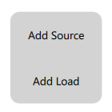

# Graphical User Interface


## Preliminary steps for using the GUI

The current version of ElectricGrid features a graphical user interface (GUI) that helps with setting up a simulation.
This is built on the library [QML.jl](https://github.com/JuliaGraphics/QML.jl), that, at the time of writing, stopped working in it's current release version.
For that reason it is required to install `QML.jl` in it's github main state manually if you want to use the gui.

```
import Pkg
Pkg.add("QML#main")
```
or press `]` in the Julia Repl to enter Pkg mode and then run
```
add QML#main
```


## Usage

To start the GUI simply run the file `gui\ElectricGridGUI.jl`. If everything works well a blank white window will open.

#### Adding sources and/or loads

Right-clicking the window opens the menu to add sources and loads.



After choosing, a node will appear at the position of the right-click.


A source node will display two symbols above itself depicting it's source type and control type.
A load will always display the house icon.

#### Connecting two nodes with a cable

Left-click a node (without dragging) to enter cable-drawing mode. When you move the cursor you can see a black line (representing a cable) spanning from the previously clicked node to the current cursor position. To connect it, just left-click the node you want to connect the cable to. To abort the process just click anywhere else.

#### Editing properties of sources and loads

To edit the properties of a node, right click it. A menu will appear allowing you to modify it's properties.


These are very simplified representations of the properties you can set within ElectricGrid. After using the GUI, you can add additional parameters by modifying the objects `CM` and `parameters` in the command line.
More info about other parameters that are compatible with ElectricGrid can be found [here](https://upb-lea.github.io/ElectricGrid.jl/dev/Env_Create/#Source).

#### Editing properties of cables

If you hover over cables, they will be highlighted by appearing wider. Right-clicking a cable opens up the menu to edit it's properties.


Here you can set the constants for `Capacity Coatings`, `Operating Inductor` and `AC Resistor`. The resulting values (constant times the cable's length) are shown next to the text input fields.

#### Changing the length of cables

A cable's length will be automatically determined by it's length on screen. You can simply drag the nodes around and length indicators will appear on all cables the node is connected to.

#### Deleting nodes or cables

Just press the red trashcan symbol in the right-click menus to delete an element. Note that deleting a node will delete all cables connected to it aswell.

#### Using a setup made with the GUI

The GUI is connected to a Julia Backend that keeps track of everything happening in it. After you close the GUI window you will have access to the objects `CM` and `parameters` from the command line.
With these you can easily create an `ElectricGridEnv` as explained [here](https://upb-lea.github.io/ElectricGrid.jl/dev/Env_Create/).