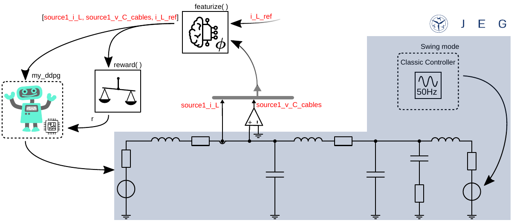
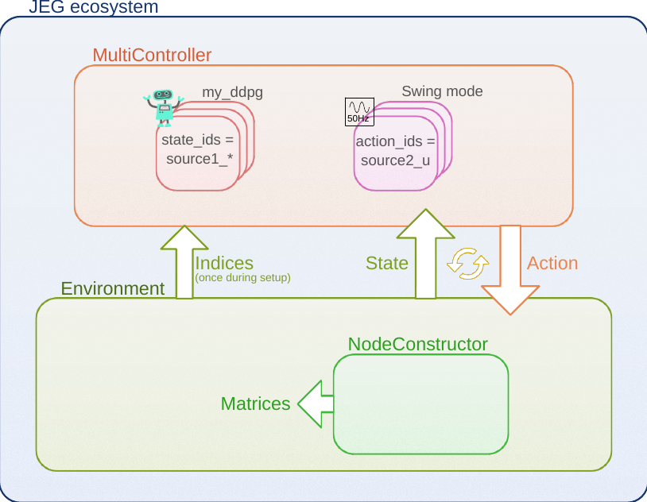

## Train an RL agent interacting with a stable grid
This section will show how combine classic stat-of-the-art controllers with reinforcement learning (RL) agents.
As example will show how to control one source with an RL agent learning a control task while connected to a stable grid provided by a classic controller. The topics covered are:

 - ### Merging classic controllers and RL agents,
 - ### Reward and featurize functions with named policys,
 - ### MultiController,
 - ### Training an RL agent in a classicly controlled grid.

The interactive content related to the section described here can be found in the form of a notebook [here](https://github.com/upb-lea/ElectricGrid.jl/blob/main/examples/notebooks/RL_Classical_Controllers_Merge_DEMO.ipynb).


## Merging classic controllers and RL agents

In the following the RL agent is trained to draw current from a stable grid.
The 3-phase electric power grid is formed by a classic controller in open-loop (`Swing`) mode. 
For more details about how the classic control works, see `Classical_Controllers_Introduction.ipynb`.

The use case is shown in the figure below.
This environment consists of a 3-phase electrical power grid with 2 sources connected via a cable (for improved clarity, only one phase is shown in the following figure).



The first source is controlled by the RL agent `my_ddpg` which should learn to draw power from the grid, therefore act like an active load.
The second source is controlled by a classic controller in open-loop mode. 
The swing mode is used to create a stable 3-phase grid to supply the load.

The environment is configured like described in [Configuring the Environment](https://upb-lea.github.io/ElectricGrid.jl/dev/Env_Create/) using the parameter dict:
```julia
using ElectricGrid

parameters = 
Dict{Any, Any}(
    "source" => Any[
                    Dict{Any, Any}(
                        "pwr" => 200e3, 
                        "control_type" => "RL", 
                        "mode" => "my_ddpg", 
                        "fltr" => "L"),
                    Dict{Any, Any}(
                        "pwr" => 200e3, 
                        "fltr" => "LC", 
                        "control_type" => 
                        "classic", "mode" => 1),
                    ],
    "grid" => Dict{Any, Any}(
        "phase" => 3, 
        "ramp_end" => 0.04,)
)
```


An appropriate `reference(t)` function has to be defined to represent the control objectives.
In this example, the time `t` will be handed over to the function to generate time-varying reference signals.
In more detail a three-phase sinusoidal reference signal shifted by 120° and an amplitude of 10 A is created.
This should teach the agent to draw time-varying current from the grid. 
The phase is thereby chosen similar to the definition in the `Swing` mode:

$i_\mathrm{L,ref} =  - 10 \,\text{cos}\left(2 \pi \,50 \, t - \frac{2}{3} \pi (n-1) \right)$, with $n \in [0,1,2]$.

Here, $n$ represents the index refering to the 3 phases of the grid.

For more enhanced reference functions, the reference current could be chosen with regards to power (active and reactive) reference values.
Feel free to implement, change and contribute! 


```julia
function reference(t)
    θ = 2*pi*50*t
    θph = [θ; θ - 120π/180; θ + 120π/180]
    return -10 * cos.(θph) 
end
```


## Reward and featurize functions with named policies

Afterwards the `featurize()` function adds the signal generated by the `reference` function to the state for the agent `my_ddpg`:


```julia
featurize_ddpg = function(state, env, name)
    if name == "my_ddpg"
        norm_ref = env.nc.parameters["source"][1]["i_limit"]
        state = vcat(state, reference(env.t)/norm_ref)
    end
end
```


Then, the `reward()` function is defined. Here, again it is based on the root-mean square error (RMSE) teaching the agent `my_ddpg` to match the reference signal to the measured signal. 

If the measured state is greater than `1` a punishment is returned which is chosen to be `r = -1`.
It not and if the measured value differs from the reference, the average error is substracted from the maximal reward: `r = 1 - RMSE`:

$r = 1 - \frac{1}{3} \sum_{{p \in \{\mathrm{a,b,c}\}}} \sqrt{\frac{|i_\mathrm{L,ref,p} - i_\mathrm{L1,p}|}{2}}$

This function is only used if the name of the policy is `my_ddpg` which was chosen in the parameter dict. 
In any other case, 1 is returned.
This could be used to define 2 different reward functions for 2 different agents via name (e.g., `my_ddpg` and `my_sac`) to learn for example a current control with the `my_ddpg` agent but a voltage control task with the `my_sac` agent.

Here, in any case but `name == my_ddpg` - so in case of the `classic` controller `r = 1` is returned.


```julia
function reward_function(env, name = nothing)
    if name == "my_ddpg"
        state_to_control_1 = env.state[findfirst(x -> x == "source1_i_L1_a", env.state_ids)]
        state_to_control_2 = env.state[findfirst(x -> x == "source1_i_L1_b", env.state_ids)]
        state_to_control_3 = env.state[findfirst(x -> x == "source1_i_L1_c", env.state_ids)]

        state_to_control = [state_to_control_1, state_to_control_2, state_to_control_3]

        if any(abs.(state_to_control).>1)
            return -1
        else

            refs = reference(env.t)
            norm_ref = env.nc.parameters["source"][1]["i_limit"]          
            r = 1-1/3*(sum((abs.(refs/norm_ref - state_to_control)/2).^0.5))
            return r 
        end
    else
        return 1
    end

end
```

Then, the defined parameters, featurize and reward functions are used to create an environment consisting of the electircal power grid. 
Here, no `CM` matrix defining the connection is used. Since the grid consists only of 2 sources that is the only connection possible. 
The `ElectricGridEnv` creates this internally based on the length of the parameter dict sources.


```julia
env = ElectricGridEnv(
    parameters = parameters, 
    t_end = 0.1, 
    featurize = featurize_ddpg, 
    reward_function = reward_function, 
    action_delay = 0);
```

## MultiController

The `MultiController` ensured that the correct states and actions are linked to the corresponding controllers/agents based on the `"control_type"` and `"mode"` defined in the parameter dict.

 - `"control_type" = "classic"`: Predefined classic controllers are used to calculate the actions for that source based on its states.

 - `"control_type" = "RL"`: Based on the defined agent name (here, `my_ddpg`), the corresponding states are forwarded to the defined RL agent which returns the actions beloning to the source.

In the following, we will use the `CreateAgentDDPG()` methode to create the DDPG `agent`. This `agent` is linked in the `my_custom_agents` dict to the chosen name `my_ddpg`, which is used in the `SetupAgents` method to configure the control side of the experiment:


```julia
agent = CreateAgentDdpg(na = length(env.agent_dict["my_ddpg"]["action_ids"]),
                          ns = length(state(env, "my_ddpg")),
                          use_gpu = false)

my_custom_agents = Dict("my_ddpg" => agent)

controllers = SetupAgents(env, my_custom_agents);
```

Like shown in the following figure, the `controllers` struct consists of 2 agents now - one per source.



Since 2 sources are defined in the env here, one controlled classically and the other by RL, the `MultiController` hands over the correct indices of the environment to the controllers.
This enables each controller, e.g., to find the correct subset of states in the entire environment state set.
In the parameter dict the first source is labeled to be controlled by the RL agent we named `my_ddpg`: 


```julia
controllers.agents["my_ddpg"]
```


    Dict{Any, Any} with 3 entries:
      "policy"     => typename(Agent)…
      "action_ids" => ["source1_u_a", "source1_u_b", "source1_u_c"]
      "state_ids"  => ["source1_i_L1_a", "source1_v_C_cables_a", "source1_i_L1_b", …


Like introduced, it has knowledge about the state and action indices of the first source.

The second source is controlled via the classic controller: 


```julia
controllers.agents["classic"]
```


    Dict{Any, Any} with 3 entries:
      "policy"     => typename(NamedPolicy)…
      "action_ids" => ["source2_u_a", "source2_u_b", "source2_u_c"]
      "state_ids"  => ["source2_i_L1_a", "source2_v_C_filt_a", "source2_v_C_cables_…


## Training an RL agent in a classicly controlled grid

Then the `Learn()` function can be used to train the agent. 
Here, only the RL agent is trained. 
The classic controller is executed to control the second source without parameter adaptions.
The `Simulate()` function can be used to run a test episode without action noise.

```julia
hook_learn = Learn(controller, env, num_episodes = 1000);
hook_sim = Simulate(controller, env, hook=hook);
```