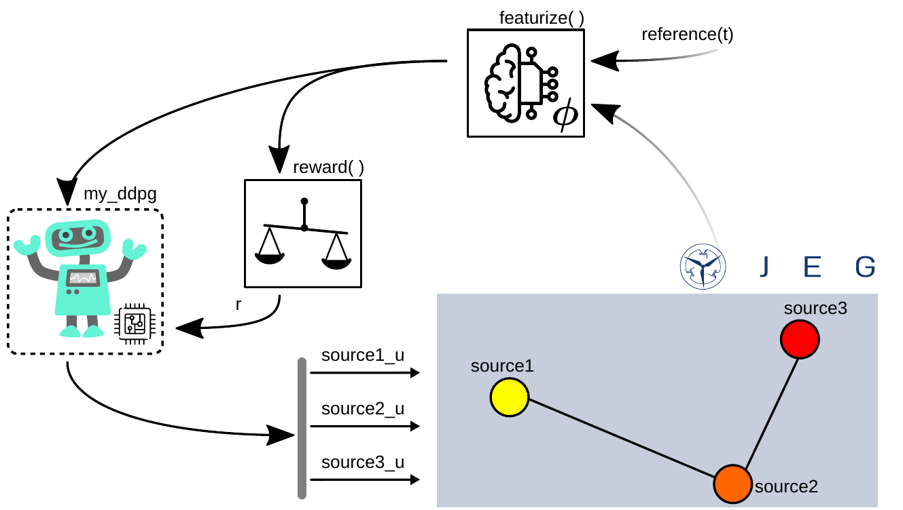

# Train an RL agent controlling different sources
In section a reinforcement learning agent is trained control 3 sources. 
The following topics will be covered:

- ### Experiment one RL agent controlling different sources
- ### Featurize and reward for all three sources
- ### Train an agent to control all three sources
 
The interactive content related to the section described here can be found in the form of a notebook [here](https://github.com/upb-lea/ElectricGrid.jl/blob/main/examples/notebooks/RL_Complex_DEMO.ipynb).


## Experiment one RL agent controlling different sources

The experiment is shown in the figure below. Two sources will be fed by a negative reference value and therefore act as active loads. The electrical power grid is here abstracted similar to the output of the `DrawGraph(env.nc)` methode.
The sources and loads (here no passive loads are available) shown as colored circles connected via cables.
This is similar like the usage of the GUI, where the sources, loads and cables can be parameterized and connected interactivly.



The environment is configured like described in [Configuring the Environment](https://upb-lea.github.io/ElectricGrid.jl/dev/Env_Create/) using the parameter dict.
It can be noticed, that the control `mode` for all three sources is set to the same `my_ddpg` agent.
As `reference(t)` function for simlicity, DC-values are used, one per source, since we are dealing with a single phase grid.
The first an third reference values are negative, so these sources will draw power from the grid.
The secound reference value is positiv, so the secound source will provide power.


```julia
using ElectricGrid

CM = [0.0   1.0  0
     -1.0   0.0  2.0
     0  -2.0  0.0]

parameters =
Dict{Any, Any}(
    "source" => Any[
                    Dict{Any, Any}(
                        "pwr" => 200e3,
                        "control_type" => "RL",
                        "mode" => "my_ddpg",
                        "fltr" => "L"),
                    Dict{Any, Any}(
                        "pwr" => 200e3,
                        "fltr" => "LC",
                        "control_type" =>
                        "RL", "mode" => "my_ddpg"),
                    Dict{Any, Any}(
                        "pwr" => 200e3,
                        "fltr" => "L",
                        "control_type" =>
                        "RL", "mode" => "my_ddpg"),
                    ],
    "grid" => Dict{Any, Any}(
        "phase" => 1,
        "ramp_end" => 0.04,)
)

function reference(t)
    return [-10., 230., -15.]
end
```


## Featurize and reward for all three sources

Afterwards the `featurize()` function adds the signal generated by the `reference` function to the state for the agent `my_ddpg`.
All reference values are normalized regarding to the limit current or voltage of the source they will refer to (like shown later):


```julia
featurize_ddpg = function(state, env, name)
    if name == "my_ddpg"
        refs = reference(env.t)
        refs[1] = refs[1] / env.nc.parameters["source"][1]["i_limit"] 
        refs[2] = refs[2] / env.nc.parameters["source"][2]["v_limit"] 
        refs[3] = refs[3] / env.nc.parameters["source"][3]["i_limit"] 
        
        state = vcat(state, refs)
    end
end
```


The `reward()` function again it is based on the root-mean square error (RMSE) teach the agent `my_ddpg` to match the reference signal to the measured signal. 

If the measured state is greater than `1`. In that case a punishment is returned which, here, is chosen to be `r = -1`.
It not and if the measured value differs from the reference, the average error is substracted from the maximal reward: `r = 1 - RMSE`:

$r = 1 - \frac{1}{3} \sum_{{p \in \{\mathrm{a,b,c}\}}} \sqrt{\frac{|x_\mathrm{ref,p} - x_\mathrm{meas,p}|}{2}}$

__Important here is the choise of the states!__

This is done in the first lines of the `reward()` function:

For the first and third source the current thougth the inductors are used. 
Since the `reference` value is negative, the agent should learn to draw current from the grid.
For the secound source, the voltage accros the capacitor is used and the reference value is positive. 
Therefore, the agent should learn to supply the capacitor / "build up a grid" (while the other 2 sources draw current).


```julia
function reward_function(env, name = nothing)
    if name == "my_ddpg"
        state_to_control_1 = env.state[findfirst(x -> x == "source1_i_L1", env.state_ids)]
        state_to_control_2 = env.state[findfirst(x -> x == "source2_v_C_filt", env.state_ids)]
        state_to_control_3 = env.state[findfirst(x -> x == "source3_i_L1", env.state_ids)]


        state_to_control = [state_to_control_1, state_to_control_2, state_to_control_3]

        if any(abs.(state_to_control).>1)
            return -1
        else

            refs = reference(env.t)
            refs[1] = refs[1] / env.nc.parameters["source"][1]["i_limit"] 
            refs[2] = refs[2] / env.nc.parameters["source"][2]["v_limit"] 
            refs[3] = refs[3] / env.nc.parameters["source"][3]["i_limit"]   

            r = 1-1/3*(sum((abs.(refs - state_to_control)/2).^0.5))
            return r 
        end
    else
        return 1
    end

end
```


## Train an agent to control all three sources

Then, the defined parameters, featurize and reward functions are used to create an environment consisting of the electrical power grid.
Like shown in `RL_Single_Agent_DEMO.ipynb`, again an DDPG agent is created. 
The `SetupAgents()` function is then used to configure the `controllers` utilizing the `MultiController`.


```julia
env = ElectricGridEnv(
    CM = CM,
    parameters = parameters, 
    t_end = 0.1, 
    featurize = featurize_ddpg, 
    reward_function = reward_function, 
    action_delay = 0);

agent = CreateAgentDdpg(na = length(env.agent_dict["my_ddpg"]["action_ids"]),
                          ns = length(state(env, "my_ddpg")),
                          use_gpu = false)

my_custom_agents = Dict("my_ddpg" => agent)

controllers = SetupAgents(env, my_custom_agents);
```

Here, the `controllers` struct consists only of the one `my_ddpg` agent.
This agent puts out three different actions, one per source:

```julia
controllers.agents["my_ddpg"]["action_ids"]
```


    3-element Vector{Any}:
     "source1_u"
     "source2_u"
     "source3_u"


And has knowlegde about all the states of the three sources:


```julia
controllers.agents["my_ddpg"]["state_ids"]
```


    7-element Vector{Any}:
     "source1_i_L1"
     "source1_v_C_cables"
     "source2_i_L1"
     "source2_v_C_filt"
     "source2_v_C_cables"
     "source3_i_L1"
     "source3_v_C_cables"


The next steps are straigth forward compared to the prior RL example notebooks like `RL_Classical_Controllers_Merge_DEMO.ipynb` to train the agent or simulate a test run:

```julia
hook_learn = Learn(controller, env, num_episodes = 1000);
hook_sim = Simulate(controller, env, hook=hook);
```


